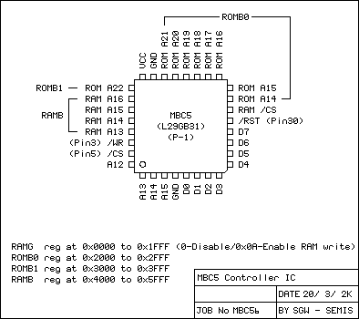

# MBC5

対応カートリッジ: 最大8MBのROM

MBC5は4代目のMBCです。MBC4が存在しないのは、日本文化では"4"が不吉な数字として扱われているためだと思われます。

MBC5は、GBCの倍速モードで正常に動作することが保証された最初のMBCです。

## メモリ

### 0000-3FFF - ROMバンク 00 (R)

ROMの最初の16KiB

### 4000-7FFF - ROMバンク 00-1FF (R)

MBC1とほとんど同じですが、\$1FFまでバンク番号をサポートしており、バンク0にスイッチ可能です。

### A000-BFFF - RAMバンク 00-0F (R/W)

MBC1と内容は同じですが、8KiB(1バンク), 32KiB(4バンク), 128KiB(16バンク)のRAMサイズをサポートしています。

## レジスタ

### 0000-1FFF - RAM有効フラグ (W)

ほとんどMBC1と同じで、\$0aを書き込むことで、外付けRAMの読み書きを有効にし、\$00を書き込むことで無効にします。

### 2000-2FFF - ROMバンク番号の下位8bit (W)

ここには、ROMバンク番号の下位8bitが入ります。`0`を書き込むと、他のMBCとは異なり、MBC5では確かにバンク0が得られます。

### 3000-3FFF - ROMバンク番号のbit9 (W)

ROMバンク番号のbit9に対応します。

### 4000-5FFF - RAMバンク番号 (W)

\$00～\$0Fの範囲で値を書き込むと、対応するRAMバンクがあれば、`0xA000..BFFF`のメモリ・エリアにマッピングされます。

**振動パック**

振動パックを搭載したカートリッジでは、RAMバンク番号レジスタのbit3が、RAMチップではなく振動回路に接続されています。このbitを1にすると、振動モーターが有効になり、再度リセットされるまで有効な状態が続きます。

振動の強さをコントロールするには、オンとオフを繰り返す必要があります。

ポケモンピンボールでは次のようにモーターの電圧を調整して、振動の強弱を使い分けています。

