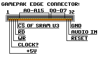
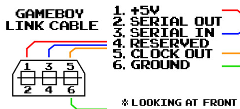

# 外部端子

## カートリッジスロット

 ピン  | 名前   | 説明
------|--------|--------------
  1   | VDD    | Power Supply +5V DC
  2   | PHI    | System Clock
  3   | /WR    | Write
  4   | /RD    | Read
  5   | /CS    | Chip Select
 6-21 | A0-A15 | Address Lines
22-29 | D0-D7  | Data Lines
  30  | /RES   | Reset signal
  31  | VIN    | External Sound Input
  32  | GND    | Ground

## 通信ポート

ピン番号は、上段が2,4,6、下段が1,3,5となっています。 ゲームボーイ用ソケットの外観は、ソケットの平らな面を上にしています。

一般的なリンクケーブルで使用されている色で、SINとSOUTがクロスしているため、ケーブルの片側で赤とオレンジの色が交換されます。

ピン | 名前 | 色  | 説明
----|------|--------|-------------
  1 | VCC  | -      | +5V DC
  2 | SOUT | 赤    | Data Out
  3 | SIN  | オレンジ | Data In
  4 | P14  | -      | Not used
  5 | SCK  | 緑  | Shift Clock
  6 | GND  | 青   | Ground

初代ゲームボーイのプラグは、ゲームボーイポケット以降のものよりも大きくなっています。そのため、大小2つのプラグを持つケーブルを使用することで、古いゲームボーイシステムと新しいゲームボーイシステムの間でリンクすることができます。

## ステレオ音声端子 (3.5mm, メス)

 ピン    | 説明
--------|-----------
 Tip    | Sound Left
 Middle | Sound Right
 Base   | Ground
