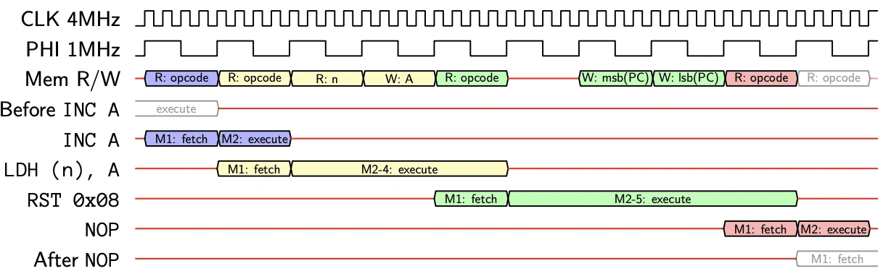

# CPU core timing

##  Fetch/execute overlap

シャープSM83は、`Fetch/execute overlap`というマイクロプロセッサの設計手法を用い、可能な限り命令実行と並行してオペコードフェッチを行うことでCPUの性能を向上させています。CPUは1M-Cycleに1回しかメモリアクセスを実行できないため、できるだけ早くメモリ操作を行うようにするのが得策です。

また、メモリ読み込みの場合、CPUは同じM-Cycleの間に読み込んだデータを使用することができないため、真の最小命令時間は1M-Cycleではなく、2M-Cycleとなります。

すべての命令は、フェッチステージに1M-Cycle、デコード/実行ステージに少なくとも1M-Cycleを必要とします。しかし、ある命令のフェッチステージは、常に前の命令の実行ステージの最後のM-Cycleと並列に実行されます。

重複する実行ステージサイクルでは、ALUやレジスタへの書き戻しなどの作業を行うかもしれませんが、メモリアクセスは次の命令のフェッチステージ用に予約されているため、実行ステージの作業内容のせいでメモリアクセスできないということはありません。

よって、すべての命令は実質的に1M-Cycle長く動作しますが、多くのプログラマ向けのドキュメントではフェッチ/命令のオーバーラップの記述は省いています。プログラムをオーバーラップしない命令の列と考え、命令時間を計算する際には実行ステージのみを考慮する方がはるかに簡単です。しかし、SM83のCPUコアをエミュレートする場合、オーバーラップを理解しエミュレートすることが有効な場合があります。

## 例

CPUが、アドレス0x1000から始まる、以下の命令を含むプログラムを実行しているとします。

```
  0x1000: INC A
  0x1001: LDH (n), A
  0x1003: RST 0x08
  0x0008: NOP
```

以下のタイミング図は、CPUが行う全てのメモリ操作と、各命令のフェッチと実行のステージを示したものです。



## 参考記事

- [Game Boy: Complete Technical Reference v112](https://gekkio.fi/files/gb-docs/gbctr.pdf)
