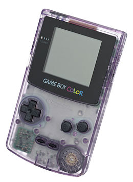

# ハードウェア一覧

## DMG(初代GameBoy)

https://www.nintendo.co.jp/n02/dmg/hardware/gb/index.html

## MGB

**GameBoy Pocket**

https://www.nintendo.co.jp/n02/dmg/hardware/gbp/index.html

**GameBoy Light**

https://www.nintendo.co.jp/n02/dmg/hardware/light/index.html

## SGB(Super GameBoy)

https://www.nintendo.co.jp/n02/sgb/

## CGB(GameBoy Color)

https://www.nintendo.co.jp/n02/dmg/hardware/color/index.html

## その他

[こちら](https://web.archive.org/web/20210525210952/https://maru-chang.com/hard/gb/index.htm)にわかりやすくまとまっています
