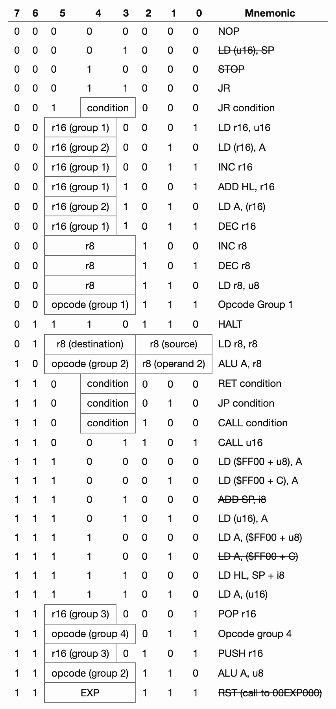

# POKEGB: ポケモン青だけをプレイ可能なゲームボーイエミュレータ

この記事は[POKEGB: a gameboy emulator that only plays Pokémon blue](https://binji.github.io/posts/pokegb/)を翻訳・意訳したものです。

先日、ここ数日で作ったエミュレータをツイートしました。

<a href="https://twitter.com/binjimint/status/1398311179164872704">
    
</a>


ツイート内の動画では、3つのポケモンボールのように見えるソースコードを示し、gccでコンパイルし、それを実行してポケモン青をプレイします。

このゲームは制御可能ですが、音はありません。グラフィックは12色（赤と青の色合い）で表示されます。

主人公の名前を「BLUE」、ライバルの名前を「JERK」にしました。

動画は、私が草むらに入るのをオーキド博士が止めたところで終わります。

多くの人から、このゲームの仕組みを書いてほしいと頼まれたので、早速書いてみましょう。


## Stats

その前に、ちょっとした統計について説明します。

あのツイートの最終版は、実際には68行のコードで構成されています（間違ってツイートしてしまいました！）。

1行の長さは150文字以下で、合計は9956バイトです。

空白やコメントを無視すると、4720バイトになります。[International Obfuscated C Code Contest](https://www.ioccc.org/) に応募するには大きすぎますが、もう少しですね。

モンスターボールの形に整形する前のソースは188行、7786バイトで、空白以外のソースは5954バイトでした。

## 概要

ゲームボーイがどのように動作するかを少し知っておくと便利でしょう。

もちろん本当は、pandocsを読んでいただくか、The Ultimate Gameboy Talkを見てもらうのが望ましいですが、このコードがどのように動作するかを理解するにはこの記事での説明で十分でしょう。

多くの値は16進数で表現するのが簡単なので、先頭に`$`をつけて書きます。例: `$FE00`


## CPU

ゲームボーイのCPUはちょっと変わっていて、Intel 8080のようでもあり、Zilog Z80のようでもありますが、どちらとも違うものです。

8ビットのアキュムレータAと、BC、DE、HLという3つの16ビットレジスタペアを持ち、これらは8ビットレジスタB、C、D、E、H、Lとして個別にアクセスできるようになっています。

16-bit | High byte | Low byte | Description
-- | -- | -- | -- 
AF | A | - | Accumulator and flags
BC | B | C | General purpose
DE | D | E | General purpose
HL | H | L | General purpose / memory access
PC | - | - | Program counter
SP | - | - | Stack pointer

また、cpuにはZ,N,H,Cという4つのフラグビットがあります。

Flag | Name | Description
-- | -- | -- 
Z | Zero flag | Set when the result is zero
N | Subtraction flag | Set if the last instruction was subtract, used for BCD
H | Half-carry flag | Set if there is an overflow out of bit 3, used for BCD
C | Carry flag | Set if there is an overflow out of bit 7


AFレジスタにアクセスする際（プッシュ／ポップ命令でのみ可能）、フラグはFの上位4ビットに次のように格納されます。

15 | 14 | 13 | 12 | 11 | 10 | 9 | 8 | 7 | 6 | 5 | 4 | 3 | 2 | 1 | 0
-- | -- | -- | -- | -- | -- | - | - | - | - | - | - | - | - | - | - 
A  | A  | A  | A  | A  | A  | A | A | Z | N | H | C | 0 | 0 | 0 | 0

ゲームボーイの命令セットには約500個の命令があり、それぞれ最大3バイトの長さです。例えば、NOP命令は1バイト（`$00`）ですが、JP命令は3バイトです。`$C3`に続いて、16bitのアドレス`$50 $01`を入力します。

命令セットは以下のように分類されます。これは、emudevのdiscordにある[peach.botさんの素晴らしいドキュメント](SM83_decoding.pdf)から引用したものです。

ドキュメントにはすべての命令が含んでいましたが、今回、ポケモン青に必要のないものは削除しています。

最初に読んだときには、遠慮なく読み飛ばしてください。



また、CBプレフィックスを使用して、別の命令セットにアクセスすることもできます。


`r8`は次のようになっています。

value | register
----- | --------
0 | B
1 | C
2 | D
3 | E
4 | H
5 | L
6 | (HL)
7 | A

`r16`は次のようになっています。

value | group1 | group2 | group3  
----- | ------ | ------ | ------
0 | BC | BC | BC 
1 | DE | DE | DE 
2 | HL | HL+ | HL 
3 | SP | HL- | AF

`condition`は次のようになっています。

value | condition | Meaning
-- | -- | --
0 | NZ | Zero flag is 0
1 | Z | Zero flag is 1
2 | NC | Carry flag is 0
3 | C | Carry flag is 1

`opcode`は次のようになっています。


value | group 1 | group 2 | group 3 | group 4
-- | -- | -- | -- | -- 
0 | RLCA | ADD | RLC | JP
1 | RRCA | ADC | RRC | CB prefix
2 | RLA | SUB | RL	| illegal
3 | RRA | SBC | RR	| illegal
4 | DAA | AND | SLA	| illegal
5 | CPL | XOR | SRA	| illegal
6 | SCF | OR | SWAP	| DI
7 | CCF | CP | SRL	| EI

ご覧のように、たくさんの命令がありますが、約40の異なるカテゴリーに分類することができ、（私の知る限り）そのうち5つはポケモン青では使われていません。

追記: 私が間違っていたことがわかりました。RRAは使われています。[pokeredのTryingToLearn関数](https://github.com/pret/pokered/blob/2954013da1f10e11db4ec96f9586b7c01706ae1a/engine/pokemon/learn_move.asm#L109)を見てください。

さらに複雑なのは、これらの命令が実行されるまでの時間です。

これは、CPUの周波数である4.19MHzで実行される「T-state」という単位で測定されます。

すべての命令はT-stateの4の倍数で動作し、これはしばしばマシンサイクルまたは「M-cycles」(Mサイクル)と呼ばれます。つまり 1 M-cycles = 4 T-state です。

グラフィックスレンダリングやオーディオなど、他のハードウェアコンポーネントの実行にも時間がかかるため、各命令が何Mサイクルかかるかを把握することは重要であり、CPUとこれらのコンポーネントが常に同期していることを確認する必要があります。

幸いなことに、ほとんどの命令のMサイクル数は比較的単純で、1回のメモリアクセスに1Mサイクルかかります（命令の読み取りコストを含む）。

中には追加のMサイクルを要する命令もありますが、そのような場合は明示的に処理することができます。

## タイル

背景レイヤー、ウィンドウレイヤー、スプライトレイヤーは、すべて8x8のタイルで構成されています。

各タイルは16バイトで、ピクセルごとに2ビットを使用しています。各ピクセルには、ロービットとハイビットがあります。ロービットとハイビットはそれぞれ別のバイトに格納されており、各バイトは1列分を格納しています。


Offset | Row | Bit
-- | -- | -- 
0 | Row 0 | Low bit
1 | Row 0 | High bit
2 | Row 1 | Low bit
3 | Row 1 | High bit
4 | Row 2 | Low bit
5 | Row 2 | High bit
6 | Row 3 | Low bit
7 | Row 3 | High bit
8 | Row 4 | Low bit
9 | Row 4 | High bit
10 | Row 5 | Low bit
11 | Row 5 | High bit
12 | Row 6 | Low bit
13 | Row 6 | High bit
14 | Row 7 | Low bit
15 | Row 7 | High bit

例えば、タイトル画面で主人公が手に持っているモンスターボールを描きたいとします。


そして、タイルを2つのビットプレーンに分け、低ビットプレーンには0か1の値のみ、高ビットプレーンには0か2の値のみを持たせます。各ピクセルごとにそれらを足し合わせると、上のようなイメージになります。


そして、これらのビットプレーンを上図のようにインターリーブして、このタイルの16バイトを得ます。

```
$1C $1C $2A $32 $4D $73 $41 $7F $21 $5D $22 $22 $0C $1C $00 $00
```


## Making Pokegb

それはさておき、私がどのようにしてpokegbを作ったのかを少しお話したいと思います。

5月24日に作業を開始しました。ゲームボーイのエミュレータ(binjgb)を書いたことがあるので、ある程度のことはわかっていました。

しかし、ポケモン青のコードについてはあまり知らなかったのです。

ゲームボーイにはたくさんの機能がありますが、ポケモン青がどのくらいの数の機能を使っているのか知りませんでした。

コードを小さくするためには、多くの機能を実装しないようにすればいいと思っていました。

まずはbinjgbでゲームを読み込み、命令をトレースしてみることにしました。トレースの出力は次のようになりました。

```
A:01 F:Z-HC BC:0013 DE:00d8 HL:014d SP:fffe PC:0100 (cy: 0) ppu:+0 |[00]0x0100: 00        nop
A:01 F:Z-HC BC:0013 DE:00d8 HL:014d SP:fffe PC:0101 (cy: 4) ppu:+0 |[00]0x0101: c3 50 01  jp $0150
A:01 F:Z-HC BC:0013 DE:00d8 HL:014d SP:fffe PC:0150 (cy: 20) ppu:+0 |[00]0x0150: fe 11     cp a,17
A:01 F:-N-C BC:0013 DE:00d8 HL:014d SP:fffe PC:0152 (cy: 28) ppu:+0 |[00]0x0152: 28 03     jr z,+3
A:01 F:-N-C BC:0013 DE:00d8 HL:014d SP:fffe PC:0154 (cy: 36) ppu:+0 |[00]0x0154: af        xor a,a
A:00 F:Z--- BC:0013 DE:00d8 HL:014d SP:fffe PC:0155 (cy: 40) ppu:+0 |[00]0x0155: 18 02     jr +2
A:00 F:Z--- BC:0013 DE:00d8 HL:014d SP:fffe PC:0159 (cy: 52) ppu:+0 |[00]0x0159: ea 1a cf  ld [$cf1a],a
A:00 F:Z--- BC:0013 DE:00d8 HL:014d SP:fffe PC:015c (cy: 68) ppu:+0 |[00]0x015c: c3 54 1f  jp $1f54
...
```

これは、各命令の後にCPUの状態を逆アセンブルとともにプリントアウトしたものです。

私がpokegbを始めたとき、最初の数日間はほとんどCPUの実装に費やしました。

実装されていない命令にぶつかるたびに、それを実装して、それ以上実行されるかどうかを確認していました。

pokegbにはbinjgbと同じようなトレース出力を書かせて、両者が乖離しているかどうかを確認していました。

pokegbは精度がかなり低いので、残念ながら2つのトレース出力の差分を取ることで自動的に精度をテストすることはできませんでした。なので、その代わりに、出力が大きくずれているかどうかを逐一チェックしなければなりませんでした。

数日後、CPUの状態は良好なようでした。ゲームは何百万回もの命令を失敗することなく実行し、binjgbともよく一致していました。この時点で、グラフィックのレンダリングに着手し、いくつかの入力を追加しました。

驚いたことに、この時点ですべてがうまくいくようになりました。あとはいくつかの命令を実装するだけで、歩き回ったり、会話をしたり、バトルをしたりできるようになりました。ただ、まだあまり遊んでいないので、バグがあるかもしれません。


## コード

難読化されたコードを見てみましょう。難読化されていないバージョンを作ってみました。実際のコードそのままではなく、この記事を書くにあたって、変数に良い名前をつけたり、clang-formatでフォーマットしたりしていますが、それ以外は変更していません。

トップから見ていきましょう。

### マクロによるオペコードの定義

前述のように、ほとんどの命令は約40のカテゴリのいずれかに分類されます。それらを分類しやすくするために、次の10種類のマクロを作りました。`OP4_NX8`, `OP4_NX16_REL`, `OP5_FLAG`, `OP8_NX8_REL`, `OP7_PTR`, `OP7_NX8`, `OP7_NX8_PTR`, `OP49_REL`, `OP56_PTR_REL`, `OP9_IMM_PTR`

命名規則は次のとおりです。

- `OPn`: このマクロで`n`個の命令を定義
- `NXm`: 各命令は`m`の倍数だけ間隔を空けている。
- `PTR`: このマクロでは、8bitソースレジスタのアドレスを指す変数`ptr8`も設定されます。
- `REL`: このマクロは、グループ内の指定されたオペコードのオフセットである変数`opcode_rel`を設定します。例えば、`OP4_NX16_REL`は0,16,32,48のどれかの値を取る`opcode_rel`を設定します。これは、レジスタ配列へのインデックスに役立ちます。
- `IMM`: このマクロでは`ADD A, u8`のような即値命令を定義します。
- `FLAG`: このマクロは、条件コードを使用する命令(例: `CALL NZ,u16`)と、その無条件版(例: `CALL u16`)を定義します。

興味深いマクロをご紹介しましょう。

まずは`OP5_FLAG`です。このマクロでは、4つの条件付き命令と無条件版が定義されています。ここでは、変数`carry`を再利用して、演算を実行すべきかどうかを判断しています。

```c++
#define OP5_FLAG(_, always)                                                    \
  OP4_NX8(_)                                                                   \
  case always:                                                                 \
    carry = (opcode == always) ||                                              \
            (F & F_mask[(opcode - _) / 8]) == F_equals[(opcode - _) / 8];
```

配列`F_mask`と配列`F_equals`は、上記の条件表をエンコードするために定義されており、Fはフラグレジスタです。

例えば，条件`NZ`は，Zフラグがセットされていない場合に命令を実行することを意味します。

Zフラグはフラグレジスタのビット7、つまり10進数で128です。ですから、Zがセットされていないかどうかは、`(F & 128) == 0`と計算すればわかります。

```c++
int F_mask[] = {128, 128, 16, 16},
    F_equals[] = {0, 128, 0, 16};
```

次は`OP9_IMM_PTR`です。

このマクロは9つの命令を定義しており、上記の`r8`テーブルの各エントリに1つずつ、および即値命令（常に70のオフセット）に1つずつです。

これらの命令は、それぞれ8bitのオペランドで動作します。つまり、7つのレジスタ（A、B、C、D、E、H、L）のうちの1つ、アドレスHLのバイト、または即値のu8です。

関数`read8_pc()`はPCの次のバイト（つまり、命令ストリームの次のバイト）を読みます。関数`read8()`はどのアドレスのバイトでも読むことができますが、デフォルトではHLのバイトを読みます。

また、前述の通り、`ptr8`は8ビットレジスタの1つを指します。

```c++
#define OP9_IMM_PTR(_)                                                         \
  case _ + 6:                                                                  \
  case _ + 70:                                                                 \
    OP7_PTR(_)                                                                 \
    operand = (opcode == _ + 6)    ? read8()                                   \
              : (opcode == _ + 70) ? read8_pc()                                \
                                   : *ptr8;
```

### レジスタ

ゲームボーイのほとんどのレジスタは、16ビットのペアでも8ビットの部分でもアクセスできるように作るのが便利です。そのため、すべてのCPUレジスタは初期値とともに配列で定義されています。

これらは、`C`,`B`,`E`,`D`,`L`,`H`,`F`,`A`,`SPLow`,`SPHigh`の順に定義されています。これにより、ホストマシンがリトルエンディアンであれば、16ビットのレジスタペアを直接読み取ることができます。

なお、`SP`は8ビットレジスタとしてアクセスされることはないので、ここで定義する必要はありません。ここは、追加のバイトを節約できる場所かもしれません。

AレジスタとFレジスタは多くの命令で直接使用されるので、名前で参照を作成します。

```c++
uint8_t reg8[] = {19, 0, 216, 0, 77, 1, 176, 1, 254, 255},
        &F = reg8[6],
        &A = reg8[7];
```

前述のグループ`r8`では、`B`,`C`,`D`,`E`,`F`,`H`,`L`,`(HL)`,`A`の順に使用しています。配列`reg8_group`はこれに一致しますが、代わりに`&F`を使用します。これは実際に使用されることはないので、1バイト節約するために代わりに`0`とすることもできました。

```c++
uint8_t *reg8_group[] = {reg8 + 1, reg8,
                         reg8 + 3, reg8 + 2,
                         reg8 + 5, reg8 + 4,
                         &F,       &A}
```

先ほど`r16`には3つのグループがあることを説明しました。ここではそれぞれのグループを変数`reg16`を用いて定義していきます。

グループ2は`BC, DE, HL+, HL-`を意味しています。

`HL+`,`HL-`の動作はここには含まれておらず、代わりに配列`HL_add`を介して命令の実装で直接使用されています。

AやFと同様に、HLやSPも直接使われることが多いので、名前での参照を設けました。

```c++
uint16_t PC = 256,
         *reg16 = (uint16_t *)reg8,
         *reg16_group1[] = {reg16, reg16 + 1, &HL, &SP},
         *reg16_group2[] = {reg16, reg16 + 1, &HL, &HL},
         &HL = reg16[2], &SP = reg16[4];

int HL_add[] = {0, 0, 1, -1};
```

最後に、CPUのフラグを設定するヘルパー関数を紹介します。

ヘルパー関数の引数`Mask`は、この命令で設定されるはずのフラグをマスクアウトし、引数`Z`,`N`,`H`,`C`が新しい値を設定します。

サイズの最適化として、ここではZフラグを否定しています。これは、多くの命令が結果が0の場合にZフラグを設定するためで、`set_flags()`を呼び出すすべての場所ではなく、ここで論理否定(`!`)を実行するのが便利です。

```c++
void set_flags(uint8_t mask, int Z, int N, int H, int C) {
  F = (F & mask) | (!Z * 128 + N * 64 + H * 32 + C * 16);
}
```

### メモリ

システムのすべてのメモリは、固定長の配列またはメモリマップされた領域に格納されています。

```c++
uint8_t *rom0, *rom1, *extram, *extrambank;
```

- `rom0`: ROMの最初の16KiBバンク(バンク0)へのポインタです。これは、プログラムの最初にメモリマップされます。
- `rom1`: 現在`$4000-$7FFF`にマッピングされているROM1のバンクへのポインタです。
- `extram`: 32KiBの外部RAM全体へのポインタです。これは、プログラムの最初にメモリマップされます。
- `extrambank`: 現在マッピングされている8KiBの外部RAMへのポインタです。

```c++
uint8_t io[512], video_ram[8192], work_ram[16384];
```

- `io`: メモリ領域`$FE00-$FFFF`に対応していて、OAM,I/O,HRAMを表します。
- `video_ram`: VRAM(8KiB)を表します。
- `work_ram`: 16KiBのWRAMを表します。

IF、LCDC、LY、DIVの各レジスタは頻繁に使用されるため、配列`io`を経由せずに名前で参照する方がソースコードの節約になります。

```c++
uint8_t &IF = io[271], &LCDC = io[320], &LY = io[324];
uint16_t &DIV = (uint16_t &)io[259];
```

`frame_buffer`は長さ23040(160x144)のint型のバッファで、各要素が各pixelに対応しています。今回は32bitのRGBA値を保存できるようにint型にしました。

```c++
int frame_buffer[23040];
int palette[] = {-1,        -23197,    -65536, -16777216, -1,     -8092417,
                 -12961132, -16777216, -1,     -23197,    -65536, -16777216};
```

パレットの値は奇妙に見えますが、ソースコードのサイズを小さくするために符号付き整数として格納されています。

16進数で書かれていると、より自然に見えます。なお、これらの値は、赤チャンネルが最下位バイト、アルファチャンネルが最上位バイトとなるように格納されています。


## メモリアクセス

CPUが一度に読み書きできるのは1バイトだけです。関数`mem_access()`は、ソースコードのサイズを節約するために、読み取りと書き込みの両方を実装しています。

`write`が0のときは`val`は使われず、逆に`write`が0でないときは`mem_access()`の返り値は使いません。

まず、すべてのメモリアクセスが`tick()`を呼び出すことに注意してください。これは、8ビットのメモリアクセスに必要なT-ステートの数である4だけサイクルカウンタをインクリメントします。

サイズを最適化するために、`read8()`と`write8()`の両方がHLをデフォルトのアドレスとしています。よって引数`addr`を省略可能にするため、`write8()`は、valを最初のパラメータ、addrを2番目のパラメータとしてやる必要があります。

`mem_access()`では、アドレスを12だけ右にシフトします。これにより、アドレスの最上位ニブルが抽出され、メモリのどの領域にアクセスしたかを判断することができます。

```c++
void tick() { cycles += 4; }

uint8_t mem_access(uint16_t addr, uint8_t val, int write) {
  tick();
  switch (addr >> 12) {
    ...
  }
}

uint8_t read8(uint16_t addr = HL) { return mem_access(addr, 0, 0); }

void write8(uint8_t val, uint16_t addr = HL) { mem_access(addr, val, 1); }
```

ケース2と3の場合(つまり`addr >> 12 = 2 or 3`)、アクセスされるアドレスは`$2000-$3FFF`の範囲になります。

この領域が書き込まれると、ROMバンク1が再マッピングされます。各バンクは`1<<14`つまり16KiBなので、バンク番号は14だけ左にシフトされます。

そのほかには、以下のケース0と1があります。0と1の場合、アクセスするアドレスは`$0000-$1FFF`の範囲で、ROMバンク0にあります。

```c++
case 2: case 3:
  if (write)
    rom1 = rom0 + ((val ? val & 63 : 1) << 14);

case 0: case 1:
  return rom0[addr];
```

TODO

### 初期化

`main()`関数は、まずROMと外部RAM領域を初期化します。

ポケモン青はROMサイズが1MiBであることがわかっているので、直接`mmap`することができます。`PROT_READ`などのラベルを使わずに直接数字を使ってフラグを指定すれば、`fopen/fread`よりも若干のスペースを節約できます。

```c++
int main() {
  rom1 = (rom0 = (uint8_t *)mmap(0, 1048576, PROT_READ, MAP_SHARED, open("rom.gb", O_RDONLY), 0)) + 32768;
  ...
}
```

同様に、外付けRAMファイルを`mmap`することもできます。この場合、この領域への書き込みは自動的にSaveファイルに書き込まれるので、さらに便利です。

ちょっと厄介なのは、ファイルが正しい長さに切り詰められていないと、書き込みによってエミュレータがクラッシュすることです。これは、Linuxの場合は問題起きても動作を続けるようですが、macOSではクラッシュします。


```c++
tmp = open("rom.sav", O_CREAT|O_RDWR, 0666);
ftruncate(tmp, 32768);
extrambank = extram = (uint8_t *)mmap(0, 32768, PROT_READ | PROT_WRITE, MAP_SHARED, tmp, 0);
```

LCDCとDIVのI/Oレジスタは、binjgbに合わせて初期値が設定されています。これは実際には必要ではなく、何バイトか節約するために削除することができると思われます。

```
LCDC = 145;
DIV = 44032;
```

次にSDLを初期化しましょう。

```c++
SDL_Init(SDL_INIT_VIDEO);
```

次に、ゲームボーイの画面の5倍の大きさのウィンドウを作ります。レンダラはここに描画を行います。

```c++
SDL_Renderer *renderer = SDL_CreateRenderer(
    SDL_CreateWindow("pokegb", 0, 0, 800, 720, SDL_WINDOW_SHOWN),
    -1,
    SDL_RENDERER_PRESENTVSYNC
);
```

また、ゲームボーイの解像度でテクスチャを作成し、後でロックして描画することにしました。

```c++
SDL_Texture *texture = SDL_CreateTexture(
    renderer,
    SDL_PIXELFORMAT_RGBA32,
    SDL_TEXTUREACCESS_STREAMING,
    160, 144
);
```

そして最後に、キーボードの状態を表す配列を取得します。便利なことに、この配列はイベントをポーリングするたびにSDLによって自動的に更新されます。

```c++
key_state = SDL_GetKeyboardState(0);
```


