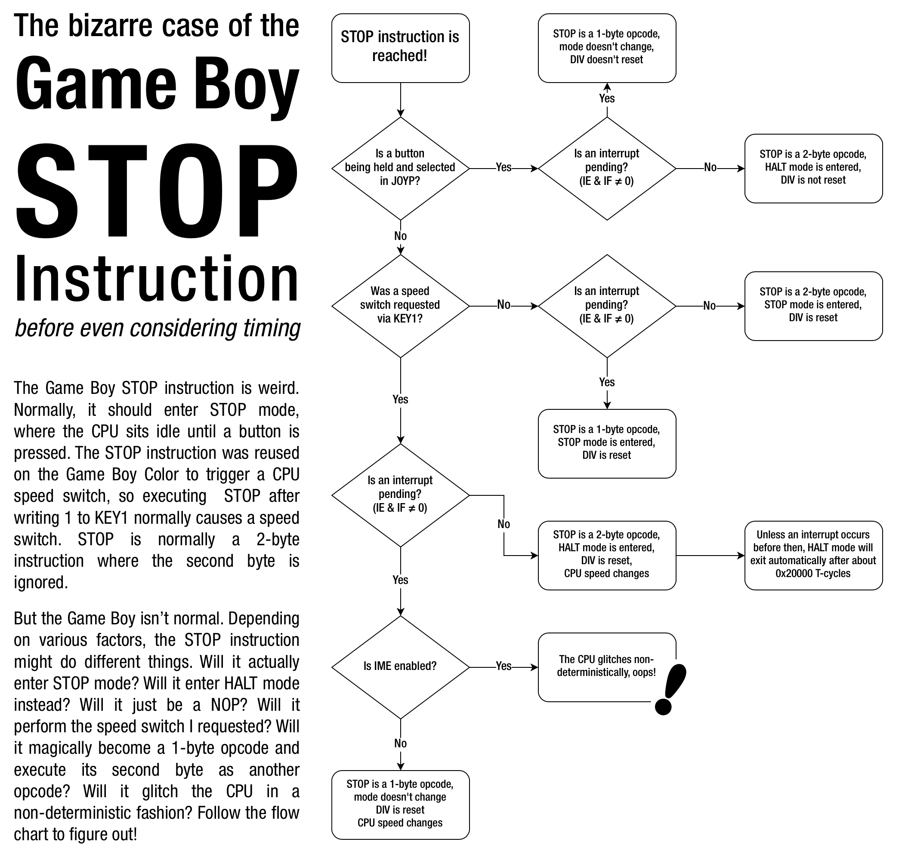

# 電池の消費を少なくするためには

ゲームボーイのハードウェアの消費電力を削減し、電池の寿命を延ばすために、以下のようなプログラミングテクニックがあります。

## HALT命令を使う

HALT命令は、消費電力を抑えるために可能な限り使用する必要があります。

IEレジスタ(\$FFFF)で有効化された割り込みがIFでフラグがセットされるまでCPUは停止したままとなり、IMEが有効な場合は割り込みが処理され、HALTの直後の命令で実行が継続されます。

ゲームで必要とされるCPU時間に応じて、HALT命令はバッテリー寿命を5％から50％、あるいはそれ以上に延ばすことができます。

VBlankイベントを待つ場合、次のコードは電力消費の観点から見るといい例とは言えません。

```asm
.wait
    ld   a, [$FF44] ; LY
    cp   a, 144
    jr   nz, .wait
```

次のようにコードを書き直すことで電力消費を抑えることができます。

この場合、VBlank割り込みを有効にして、VBlank割り込みハンドラで`vblank_flag`（RAM上に確保された1バイトの変数）を0以外の値に設定する必要があります。

```asm
  ld   hl, vblank_flag  ; hl = pointer to vblank_flag
  xor  a                ; a = 0
.wait
  halt                  ; suspend CPU - wait for ANY enabled interrupt
  cp   a, [hl]          ; is the vblank_flag still zero?
  jr   z, .wait         ; keep waiting if zero
  ld   [hl], a          ; set the vblank_flag back to zero
```

変数`vblank_flag`は、HALT期間が VBlank割り込みで終了したか、他の割り込みで終了したかを判断するために使用されます。

ただし、VBlank割り込みは`cp`命令の後、`jr`命令の前に発生する可能性があります。その場合、上記のコードはVBlankがあったことに気づかず、再びジャンプしてHALTしてしまいますのでご注意ください。

また、VBlank以外の割り込みを使用しない（またはそもそも割り込みを使用しない）ゲームの場合は、VBlank割り込みのみを有効にし、HALT命令を使用するだけで、VBlankが発生したときにのみメインコードの実行を再開することも可能です。

## STOP命令を使う

The STOP instruction is intended to switch the Game Boy into VERY low
power standby mode. For example, a program may use this feature when it
hasn't sensed keyboard input for a longer period (for example, when
somebody forgot to turn off the Game Boy).

No licensed rom makes use of STOP outside of CGB speed switching.
Special care needs to be taken if you want to make use of the STOP
instruction.

On a DMG, disabling the LCD before invoking STOP leaves the LCD enabled,
drawing a horizontal black line on the screen and very likely damaging the
hardware.

On CGB, leaving the LCD enabled when invoking STOP will result in a
black screen. Except if the LCD is in Mode 3, where it will keep drawing
the current screen.

STOP is terminated by one of the P10 to P13 lines going low. For this
reason, d-pad and/or button inputs should be enabled by writing $00,
$10 or $20 to the `P1` register before entering STOP (depending on which
buttons you want to terminate the STOP on).



## サウンドコントローラを無効化する

もし、プログラムでサウンドを全く使用しない（または、ある期間だけ使用する）場合は、レジスタFF26に00hを書き込むことで、GBの消費電力を16%以上削減できます。

サウンドは、同じレジスタに80hを書き込むことで再びオンにすることができますが、すべてのサウンドレジスタを再初期化する必要があります。

ゲームボーイの電源を入れると、デフォルトでサウンドが有効になりますが、使用しないときは手動でオフにする必要があります。

## CGBの倍速モードを使わないようにする

CGB倍速モードは消費電力が大きいため、可能な限り通常の速度で使用することをお勧めします。

ただし、速度切り替え時には一瞬表示が崩れるので、ゲーム中やタイトル画面中に速度を変えるのは得策ではありません。

## Z80の最適化手法を学ぼう

上記の省電力方法のほとんどは、効率的でタイトなアセンブラコードを使用し、できるだけCPUパワーを必要としない場合に最良の結果をもたらします。

高レベルの言語を使用すると、アセンブリを直接書くよりは最適化の度合いが低いため、より多くのCPUパワーが必要となり、これらのテクニックはそれほど大きな効果を発揮しません。

コードを最適化するには、[このページ](http://wikiti.brandonw.net/index.php?title=Z80_Optimization)を参考にするとよいでしょう。ただし、このページはオリジナルのZ80に適用されているので、最適化はGBZ80に合わせて行う必要があります。
