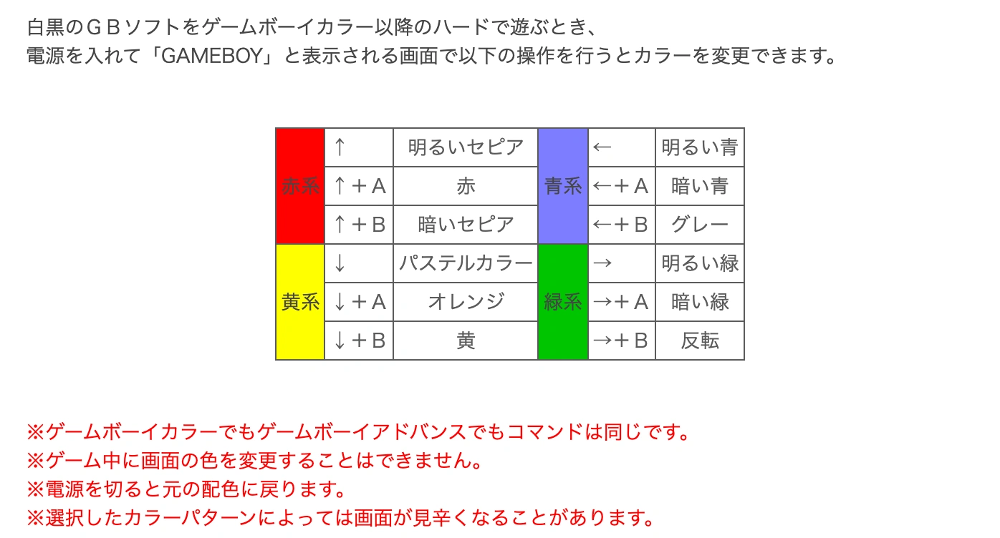
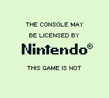

# 電源ON時の処理

ゲームボーイの電源を入れたとき、CPUが命令を実行し始めるのは実は`$0100`ではなく、`$0000`なのです。

最初にカートリッジのROMにマッピングされるのは、CPUの中に焼かれたブートROMと呼ばれるプログラムです。

このプログラムは、カートリッジのROMに制御が引き継がれる前に流れる起動アニメーションを担当しています。そしてブートROMがカートリッジのROMに制御を渡すのが`$0100`というアドレスなのです。

開発者はブートROMを気にする必要がないので、スタートアドレスは通常`$0000`ではなく`$0100`と表記されています。

そして、公式ブートROMには以下の8種類が存在することが知られています。

名称 | サイズ(bytes) | 備考
-----|--------------|------------------------------------------------------------
DMG0 | 256          | ロゴに`®`がなく、ロゴチェックに失敗すると画面が点滅する
DMG  | 256          | --
MGB  | 256          | DMG版と1バイトだけ違う
SGB  | 256          | Only forwards logo to SGB BIOS, performs no checks
SGB2 | 256          | Same difference to SGB than between MGB and DMG
CGB0 | 256 + 1792   | 波形メモリの初期化をしない
CGB  | 256 + 1792   | Split in two parts, with the cartridge header in the middle
AGB  | 256 + 1792   | [TOCTTOU](#ロゴチェックのスキップ)の修正済み

ブートROMを逆アセンブルしたものが[こちら](https://github.com/ISSOtm/gb-bootroms)で閲覧可能です。

## 📺 モノクロモデル(DMG0, DMG, MGB)

モノクロゲームボーイのブートROMは、カートリッジヘッダからロゴを読み込み、VRAMに展開した後、ゆっくりとスクロールさせ始めます。カートリッジがない状態で電源を入れるとブラックボックスがスクロールするのは、カートリッジがない状態でロゴを読み込むと通常`0xFF`が返ってくるためです。また、接続不良や汚れがあると、読み込んだデータが壊れてしまい、ロゴが乱れてしまうことがあります。

ロゴのスクロールが終わると、ブートROMは聞き覚えのあるサウンドを再生し、再度ロゴを読み込んで、保存されているコピーと比較します。

さらに、ヘッダのチェックサムを計算し、ヘッダに格納されているチェックサムと比較します。これらのチェックに失敗するとブートROMはロックされ、カートリッジROMには制御が移らないため、ゲームが始まることはありません。

最後に、ブートROMが`BANK`レジスタ(0xFF50)に書き込むことで、ブートROMがアンマップされます。`ldh [$FF50], a`命令は`0x00FE`に2バイト長の命令として配置されており、カートリッジROMから最初に実行される命令は`0x0100`になります。

Aレジスタは`$FF50`への書き込みに使用されているので、その値はカートリッジROMに渡されます。DMGとMGBのブートROMの違いは、前者が`0x01`を書き込み、後者が`0xFF`を使用するという点だけです。

**DMG0**

DMG0は、初期のDMGに搭載されていた初期型の珍しいブートROMです。ブートROMの動作内容は全体的に同じですが、コードのかなりの部分が再編成されています。

興味深いことに、DMG0のブートROMは、何かを表示する前に、ロゴとチェックサムの両方のチェックを行います。どちらかの検証に失敗すると、画面が点滅し、白一色と黒一色が交互に繰り返されてブートROMがロックされます。

また、DMG0のブートROMには、任天堂のロゴの横にある`®`マークがありません。

## 🎮 スーパーゲームボーイ(SGB, SGB2)のブートROM

スーパーゲームボーイのブートROMは、ヘッダの検証を行わないという点でかなりユニークです。

その代わり、モノクロゲームボーイのブートROMと同じように、ヘッダからVRAMに任天堂のロゴをセットしますが、その後、パケットヘッダバイト`$F1,$F3,$F5,$F7,$F9,$FB`の順で、標準的なパケット転送手順でヘッダ全体をSGB BIOSに送ります。

これらのパケットIDは無効であり、通常のSGB動作では使用されませんが、すべてのSGB BIOSリビジョンでフィルタリングされているわけではないようです。

そして、ブートROMは、何のチェックも行わずに、自らのブートROMをアンマップし、カートリッジROMに実行を渡します。

スーファミのプログラムであるSGB BIOSは、任天堂ロゴとヘッダチェックサムを自ら検証しています。どちらかの検証に失敗すると、BIOS自体がロックされ、カートリッジ内のSGBのCPUが繰り返しリセットされるようになっています。

DMGとMGBのブートROMと同様に、SGBとSGB2のブートROMは、`$01`と`$FF`をそれぞれ`$FF50`に書き込みますが、これがSGBとSGB2のブートROMの唯一の違いです。

パケット送信ルーチンの働きにより、セットビット(`0b1`)の転送はリセットビット(`0b0`)の転送よりも1サイクル速くなります。つまり、SGBのブートROMでかかる時間は、カートリッジのヘッダに依存することになります。また、ブートROMは各パケットを転送した後に4つのVBlankを待つため、完全ではありませんが、タイミングがグループ化されるため、ヘッダと時間の関係はより複雑になります。

## 🌈 カラーモデル(CGB0, CGB, AGB)

### サイズ

カラーモデルのブートROMは互換性維持のためか、先のモデルたちより複雑なものになっています。

ブートROMは、上の表にあるように、合計2048バイトと大きくなっています。ブートROMのマッピングは、CPUの起動位置である`$0000`を起点に行われますが、`$0100..014F`のカートリッジヘッダにもアクセスしなければなりません。もし2048バイトをそのまま`$0000`からマッピングするとカートリッジヘッダ部分とアドレス空間が衝突してしまいます。

そのため、ブートROMは実際には2つの部分に分かれており、`$0000..00FF`のものと`$0200..08FF`のものがあります。

### 挙動

まず、ブートROMでは、互換性のためと思われますが、モノクロモデルと同様にVRAMに任天堂ロゴを展開し、同時にHRAMのバッファにロゴをコピーしています。HRAMは、WRAMと違ってCPU内に組み込まれているため、改ざんができないことから採用されたと推測されています。

その後、ロゴの読み込みと解凍が行われますが、サイズ変更は行われず、大きな「GAME BOY」ロゴの下に、より小さなロゴが配置されます。その後、ブートROMは後述する互換性パレットを設定し、ロゴのアニメーションを「ピコーン！」という音とともに再生します。

ロゴのアニメーション中に、CGB互換性バイト(`$0143`)のbit7がリセットされた場合、つまりカラーモデルで起動したがモノクロのゲームであることがわかった場合、ゲームを遊んでいる人は互換性のために選択されたパレットを上書きするためのパレットを選ぶことができます。

パレットを選択するたびに、アニメーションが30フレーム終了しなくなり、チェックやフェードアウトが遅れる可能性があることに注意してください。

そして、モノクロのブートROMと同様に、HRAMのバッファからヘッダロゴをチェックし、ヘッダチェックサムを検証します。しかし、なぜかHRAMのバッファにはロゴが全部入っているにもかかわらず、ロゴの前半部分しかチェックされません。

最後に、ブートROMはすべてのBGパレットを白にフェードして、ハードウェアを互換モードにします。

CGB互換性バイト(`$0143`)が CGB互換性を示す場合、そのバイトはKEY0(`$FF4C`)に直接書き込まれ、PGBモードが有効になる可能性があります。

それ以外の場合は、KEY0に$04が書き込まれ、CPUのDMG互換モードが有効になり、OPRIに$01が書き込まれ、`DMG OBJ Priority`が有効になり、互換パレット(後述)が書き込まれます。

さらに、ハードウェアが要求する場合には、DMGロゴのタイルマップが書き込まれます。

他のブートROMと同様に、カラーモデルのブートROMも最後にカートリッジに実行を引き渡す際に、自らのブートROMをアンマップします。ただし、`$01`や`$FF`ではなく`$11`を書き込みます。

### CGB0

DMG0のブートROMと同様に、初期のCGBには異なるブートROMが搭載されているものがあります。DMG0とDMGとは異なり、CGB0とCGBのブートROMの違いは非常に小さく、ROMのレイアウトに変更はありません。

最も注目すべき変更点は、CGB0ブートROMが波形メモリの初期化処理をしないことです。これにより、ゲーム「R-Type」のタイトル画面の音楽が異なることなどが知られています。

また、CGB0のブートROMは、WRAMのいくつかの場所に、他の変数のコピーを書き込みます。これはデバッグの残骸ではないかと推測されています。

### 互換パレット

このブートROMは、GBC上で動作するモノクロのゲームを自動的に着色する役割を担っています。

DMG互換モードでは、CGBパレットが使用されています。背景は、属性マップ全体がゼロに設定されているため、BGパレット0が使用され、オブジェクトは、属性のbit4に応じて、OBJパレット0または1が使用されます。

BGP,OBP0,OBP1は、DMGで使われるグレーシェードではなく、実際にCGBパレットにインデックスされます。

ブートROMは、以下のアルゴリズムで計算されたIDを使って互換パレットを選択します。

> [!NOTE]
> アルゴリズムの説明中に出てくるパレットIDは[パレットインデックス](./video/register/palette.md#ff68---bcpsbgpi---bgパレットインデックス)とは別物な、このアルゴリズム特有の特殊な値です。

1. [ライセンスコード(旧)](./cartridge/header.md#014b---ライセンスコード旧)が0x33かどうかチェックします
   - 0x33の場合、[ライセンスコード(新)](#0144-0145---ライセンスコード新)を見て、コードがASCII文字列"01"と等しいことをチェックします
   - ASCII文字列"01"と等しくなかった場合は数値の0x01と等しいかチェックします
   - これは任天堂のライセンスコードであるかをチェックしており、そうでなかった場合はこのアルゴリズムは終了しパレットID`0x00`が使用されます

2. [ゲームタイトル](./cartridge/header.md#0134-0143---タイトル)の16バイトの合計を計算し、タイトルチェックサムとして保存します

3. タイトルのチェックサムを[テーブル](https://github.com/ISSOtm/gb-bootroms/blob/443d7f057ae06e8d1d76fa8083650cf0be2cd0ae/src/cgb.asm#L1221-L1230)の中から探し出し、テーブルでのチェックサムのインデックスを記録します。
    - An almost-complete list of titles corresponding to the different checksums can be found in [Liji’s free CGB boot ROM reimplementation](https://github.com/LIJI32/SameBoy/blob/1d7692cff5552e296be5e1ab075c4f187f57132c/BootROMs/cgb_boot.asm#L230-L328).
    - 見つからなかった場合はパレットID`0x00`が使用されます
    - インデックスが64以下の場合は、そのインデックスをそのままパレットIDとして使用し、アルゴリズムを終了します。
    - それ以外の場合は、タイトルの4文字目に基づいて追加の処理が必要であり、次のステップに進みます。

4. [もう1つのテーブル](https://github.com/ISSOtm/gb-bootroms/blob/443d7f057ae06e8d1d76fa8083650cf0be2cd0ae/src/cgb.asm#L1232-L1240)から4文字目を探します
    - 見つからなかった場合はパレットID`0x00`が使用されます
    - 文字が見つかった場合、前のステップで得られたインデックスに、行のインデックスを14倍したものを加えて、パレットのIDを得ます。つまり，1行目で文字が見つかった場合，インデックスは変更されません。2番目の行で見つかった場合は、14だけ増え、以下同様です。

結果として得られるパレットIDは、かなり複雑なメカニズムでテーブルから3つのパレットを選ぶのに使用されます。ユーザーは、ロゴのアニメーション中に特定のボタンの組み合わせを使って、この選択を上書きすることができます。これらの手動による着色は、自動着色と同じ色を使う選択肢もあれば、ユニークな着色が可能な選択肢もあります。

チェックサム（該当する場合はタイブレークの4文字目も）と対応するパレットの表は、[TCRF](https://tcrf.net/Notes:Game_Boy_Color_Bootstrap_ROM#Assigned_Palette_Configurations)にあります。

また、パレットIDが\$43または\$58の場合は、任天堂ロゴのタイルマップがVRAMに書き込まれます。これは、任天堂ロゴで何らかのアニメーションを行うゲームを想定したもので、画面の真ん中に突然任天堂のロゴが現れます。

ちなみに、CGBのCPUには、ゲーム中にCGBのパレットを切り替えるための機能の名残があります。

## 🏟 ポケモンスタジアム2

ポケモンスタジアム2には、[GBビル(GB Tower)](https://www.nintendo.co.jp/n01/n64/software/nus_p_cp2j/gbbldg/index.html)という、ゲームボーイのポケモンを64で遊べるモードがあります。

これは内部ではエミュレータを使っており、ブートROMは特有のブートROMが使われています。US版では、オフセット`0x0159_95F0`にあり、長さはわずか1008バイトです。その目的は不明です。

このブートROMは、通常のCGBブートROMとほぼ同じ設定を行いますが、非常に早い段階で`$FF50`に書き込みを行い、その書き込みの後にロックアップループが発生します。

さらに、このブートROMには有効なカートリッジヘッダが含まれており、任天堂ロゴ、互換性フラグ(2つの互換性を示す)、ヘッダチェックサムを除いてほとんどが空白になっています。

## 👀 ロゴのチェック

ブートROMがヘッダのチェックによってROMが正常であるかを(少なくとも部分的に)検証することは意味があるかもしれません。

しかし、なぜ任天堂のロゴが厳しくチェックされるのか疑問に思うかもしれません。普通は、ロゴがおかしくても起動画面が乱れるだけだと思うでしょう。

### 海賊版対策

ロゴのチェックは、商標法による海賊版の抑止を目的としていました。

当時のゲームボーイには、現在のニンテンドースイッチのように任天堂の許可したゲームソフトだけしか動作させないような技術力がありませんでした。ファミコンには、[ロックアウトチップ](https://en.wikipedia.org/wiki/CIC_(Nintendo))のようなハード面での保護がありましたが、コストや消費電力の観点から、ゲームボーイでは見送られたと思われます。

その代わり、ブートROMのロゴチェック時に、任天堂ロゴのコピーを（エンコードして）含ませ、起動時にこのロゴを表示させました。

ロゴチェックのせいで、ロゴが正しくないとゲームができないため、ロゴチェックを突破するためにゲームソフトは任天堂のロゴをコピーしていることになります。

これを海賊版が行うと、任天堂のロゴを不正に利用したことになるため、任天堂は海賊版の開発者を商標権侵害で訴えることができました。

**自作ソフトにおいて**

この対策方法は、海賊版でない、サードパーティの自作ゲームの開発者であっても任天堂のロゴを無許可でコピーさせるという問題があります。

幸いなことに、[Sega v. Accolade](https://en.wikipedia.org/wiki/Sega_v._Accolade)事件では、ゲーム機上でプログラムを実行するために必要であれば、商標登録されたロゴの使用は問題ないという判決が（米国で）下されているので、自作ゲームの開発者にとっては危険はありません。

ただし、任天堂からのライセンスがないことを明示したい自作のゲーム開発者は、ブートROMが制御を渡した後のロゴ画面に、例えば次のようなテキストを追加することができます。

### ロゴチェックのスキップ

任天堂のロゴチェックは、任天堂からの法的措置を避けるため、何度も回避されてきましたが、ロゴチェックのスキップ方法は基本的に2つあります。

**1つ目**

1つ目の方法は、コンソールのロゴの読み取り処理（1回は描画時、もう1回はロゴチェック時）に存在する[TOCTTOU](https://en.wikipedia.org/wiki/TOCTTOU)の脆弱性を利用するもので、AGBではパッチが適用されています。  

しかし、これにはカートリッジに独自のハードウェアが必要で、しかもブートROMによってロゴを読み取るタイミングや順番が大きく異なるため、対応が難しくなっています。 

カスタムのマッパーを使用したり、アドレスラインの一部をコンデンサで保持して、修正されたロゴを含むROMの別の領域へと、ロゴの読み込み処理をリダイレクトしたりする実装もあります。

**2つ目**

2つ目の方法は、ゲームボーイカラー（およびアドバンス）専用です。

理由は不明ですが、ブートROMはロゴ全体をHRAMにコピーしますが、前半部分だけを比較します。

そのため、上半分は正しいが下半分が正しくないロゴは、CGBのブートROMではロゴチェックを通過してしまいます。不思議なことに、TOCTTOUの脆弱性を修正したにもかかわらず、CGB/AGBのブートROMはこのミスを修正していません。

## 🚀 ブートROMの処理終了後のゲーム機の状態

> [!CAUTION]
> 以下の情報は、ブートROMの動作が複雑なため、間違いを含んでいる可能性があります。ご自身の責任においてご利用ください。

### ハードウェア共通の挙動

ゲーム機のWRAMとHRAMの中身は、電源ON時にランダムに設定されます。

[機種によって傾向](https://twitter.com/CasualPkPlayer/status/1409752977812852736?s=19)は異なりますが、周囲の温度などによってもメモリの内容は変動します。また、電源を切り直しても[RAMが引き継がれる](https://www.youtube.com/watch?v=xayxmTLljr8)ことが確認されています。未定義な上に不確定要素が多すぎるため、電源ON後のWRAMとHRAMのメモリの内容に依存するのは得策ではありません。

技術的には電源ONとは関係ありませんが、カートリッジの外付けRAM(SRAM)が存在する場合、最初の電源ON時には基本的に、ランダムなゴミデータが含まれていることは覚えておいてください。ゲーム側では、SRAMの特定の決まった位置に十分な大きさの既知のバイト列を配置し、セーブデータにアクセスする前にSRAMを確認してバイト列が存在しているかを確認することを強く推奨します。

### ブートROMの処理終了後のCPUレジスタ

> [!NOTE]
> この表は、[ブートROMの逆アセンブル](https://github.com/ISSOtm/gb-bootroms)と、[Mooneye-GB](https://github.com/Gekkio/mooneye-gb)のテストROMなどから得られたものです。

Register | DMG0            | DMG                     | MGB                     | SGB             | SGB2
--------:|:---------------:|:-----------------------:|:-----------------------:|:---------------:|:---------------:
**A**    | $01             | $01                     | $FF                     | $01             | $FF
**F**    | Z=0 N=0 H=0 C=0 | Z=1 N=0 H=? C=?[1](#dmg_c) | Z=1 N=0 H=? C=?[1](#dmg_c) | Z=0 N=0 H=0 C=0 | Z=0 N=0 H=0 C=0
**B**    | $FF             | $00                     | $00                     | $00             | $00
**C**    | $13             | $13                     | $13                     | $14             | $14
**D**    | $00             | $00                     | $00                     | $00             | $00
**E**    | $C1             | $D8                     | $D8                     | $00             | $00
**H**    | $84             | $01                     | $01                     | $C0             | $C0
**L**    | $03             | $4D                     | $4D                     | $60             | $60
**PC**   | $0100           | $0100                   | $0100                   | $0100           | $0100
**SP**   | $FFFE           | $FFFE                   | $FFFE                   | $FFFE           | $FFFE

1: もしカートリッジヘッダのチェックサム(\$014D)が\$00の場合、H,Cフラグはクリアされます。それ以外は両方ともセットされます。

Register | CGB (DMG mode)  | AGB (DMG mode)             | CGB             | AGB
--------:|:---------------:|:--------------------------:|:---------------:|:---------------:
**A**    | $11             | $11                        | $11             | $11
**F**    | Z=1 N=0 H=0 C=0 | Z=? N=0 H=? C=0[2](#agbdmg_f) | Z=1 N=0 H=0 C=0 | Z=0 N=0 H=0 C=0
**B**    | ??[3](#cgbdmg_b)   | ??[3](#cgbdmg_b) + 1          | $00             | $01
**C**    | $00             | $00                        | $00             | $00
**D**    | $00             | $00                        | $FF             | $FF
**E**    | $08             | $08                        | $56             | $56
**H**    | $??[4](#cgbdmg_hl) | $??[4](#cgbdmg_hl)            | $00             | $00
**L**    | $??[4](#cgbdmg_hl) | $??[4](#cgbdmg_hl)            | $0D             | $0D
**PC**   | $0100           | $0100                      | $0100           | $0100
**SP**   | $FFFE           | $FFFE                      | $FFFE           | $FFFE

2: To determine the flags, take the B register you would have gotten on CGB[3](#cgbdmg_b), and `inc` it.
(To be precise: an `inc b` is the last operation to touch the flags.)
The carry and direction flags are always clear, though.

3: [ライセンスコード(旧)](./cartridge/header.md#014b---ライセンスコード旧)が\$01の場合、またはライセンスコード(旧)が\$33で[ライセンスコード(新)](./cartridge/header.md#0144-0145---ライセンスコード新)が "01"（\$30,\$31）の場合、Bは16個のタイトルバイトすべての合計となります。それ以外の場合、Bは\$00となります。AGB（DMGモード）の欄に「+1」と表示されているように、AGBの場合はその値が1増えます。

4: There are two possible cases:

- **The B register is $43 or $58 (on CGB) / $44 or $59 (on AGB)**: HL = $991A
- **Neither of the above**: HL = $007C

### ブートROMの処理終了後のI/Oレジスタ

> [!NOTE]
> この表は、[Mooneye-GB](https://github.com/Gekkio/mooneye-gb)のテストROMなどから得られたものです。

時間経過で変動する値に関しては、`PC=0x100`の時点のものです。

Name          | Address | DMG0 | DMG / MGB | SGB / SGB2 | CGB / AGB
-------------:|:-------:|:----:|:---------:|:----------:|:-----------:
`P1`          | $FF00   | $CF  | $CF       | $C7 or $CF | $C7 or $CF
`SB`          | $FF01   | $00  | $00       | $00        | $00
`SC`          | $FF02   | $7E  | $7E       | $7E        | $7F
`DIV`         | $FF04   | $18  | $AB       | ??[5](#unk)   | ??[5](#unk)
`TIMA`        | $FF05   | $00  | $00       | $00        | $00
`TMA`         | $FF06   | $00  | $00       | $00        | $00
`TAC`         | $FF07   | $F8  | $F8       | $F8        | $F8
`IF`          | $FF0F   | $E1  | $E1       | $E1        | $E1
`NR10`        | $FF10   | $80  | $80       | $80        | $80
`NR11`        | $FF11   | $BF  | $BF       | $BF        | $BF
`NR12`        | $FF12   | $F3  | $F3       | $F3        | $F3
`NR13`        | $FF13   | $FF  | $FF       | $FF        | $FF
`NR14`        | $FF14   | $BF  | $BF       | $BF        | $BF
`NR21`        | $FF16   | $3F  | $3F       | $3F        | $3F
`NR22`        | $FF17   | $00  | $00       | $00        | $00
`NR23`        | $FF18   | $FF  | $FF       | $FF        | $FF
`NR24`        | $FF19   | $BF  | $BF       | $BF        | $BF
`NR30`        | $FF1A   | $7F  | $7F       | $7F        | $7F
`NR31`        | $FF1B   | $FF  | $FF       | $FF        | $FF
`NR32`        | $FF1C   | $9F  | $9F       | $9F        | $9F
`NR33`        | $FF1D   | $FF  | $FF       | $FF        | $FF
`NR34`        | $FF1E   | $BF  | $BF       | $BF        | $BF
`NR41`        | $FF20   | $FF  | $FF       | $FF        | $FF
`NR42`        | $FF21   | $00  | $00       | $00        | $00
`NR43`        | $FF22   | $00  | $00       | $00        | $00
`NR44`        | $FF23   | $BF  | $BF       | $BF        | $BF
`NR50`        | $FF24   | $77  | $77       | $77        | $77
`NR51`        | $FF25   | $F3  | $F3       | $F3        | $F3
`NR52`        | $FF26   | $F1  | $F1       | $F0        | $F1
`LCDC`        | $FF40   | $91  | $91       | $91        | $91
`STAT`        | $FF41   | $81  | $85       | ??[5](#unk)   | ??[5](#unk)
`SCY`         | $FF42   | $00  | $00       | $00        | $00
`SCX`         | $FF43   | $00  | $00       | $00        | $00
`LY`          | $FF44   | $91  | $00       | ??[5](#unk)   | ??[5](#unk)
`LYC`         | $FF45   | $00  | $00       | $00        | $00
`DMA`         | $FF46   | $FF  | $FF       | $FF        | $00
`BGP`         | $FF47   | $FC  | $FC       | $FC        | $FC
`OBP0`        | $FF48   | $FF  | $FF       | $FF        | $00
`OBP1`        | $FF49   | $FF  | $FF       | $FF        | $00
`WY`          | $FF4A   | $00  | $00       | $00        | $00
`WX`          | $FF4B   | $00  | $00       | $00        | $00
`KEY1`        | $FF4D   | $FF  | $FF       | $FF        | $FF
`VBK`         | $FF4F   | $FF  | $FF       | $FF        | $FF
`HDMA1`       | $FF51   | $FF  | $FF       | $FF        | $FF
`HDMA2`       | $FF52   | $FF  | $FF       | $FF        | $FF
`HDMA3`       | $FF53   | $FF  | $FF       | $FF        | $FF
`HDMA4`       | $FF54   | $FF  | $FF       | $FF        | $FF
`HDMA5`       | $FF55   | $FF  | $FF       | $FF        | $FF
`RP`          | $FF56   | $FF  | $FF       | $FF        | $FF
`BCPS`        | $FF68   | $FF  | $FF       | $FF        | ??[6](#compat)
`BCPD`        | $FF69   | $FF  | $FF       | $FF        | ??[6](#compat)
`OCPS`        | $FF6A   | $FF  | $FF       | $FF        | ??[6](#compat)
`OCPD`        | $FF6B   | $FF  | $FF       | $FF        | ??[6](#compat)
`SVBK`        | $FF70   | $FF  | $FF       | $FF        | $FF
`IE`          | $FFFF   | $00  | $00       | $00        | $00

5: ブートROMの実行にかかる時間はヘッダの内容に依存するので、一概には決まりません。しかし、この値は、ヘッダの内容が同じなら常に固定であるべきです。

6: これらは、互換モードが有効になっているかどうかによって異なります。
