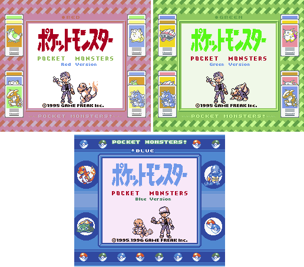

# スーパーゲームボーイ

## 概要

SGB（Super GameBoy, スーパーゲームボーイ）は、ゲームボーイのゲームをスーパーファミコンで遊ぶためのアダプタです。(以後、SGBカートリッジと呼びます)

ゲームボーイのカートリッジをSGBカートリッジに差し込んだ後、それをスーパーファミコンに差し込みます。


## 仕組み

SGBカートリッジには、ゲームボーイのCPUとビデオコントローラが入っています。

通常、このビデオコントローラからの映像信号は液晶画面に送られますが、今回の特別なケースでは、SGBカートリッジに搭載されている特別なSNESのBIOSを使用して、SNESが映像信号を読み出し、テレビに表示します。

また、ゲームボーイの音声出力はスーファミに転送されてテレビに出力されます。

逆にジョイパッドの入力はスーファミのコントローラからゲームボーイのジョイパッドの入力に転送されます。

## モノクロのゲーム

ゲームボーイ(DMG)のゲームは、SGBのハードウェアでも動作します。

SGBでは、通常の4色のグレーシェードの代わりに4色のパレットが適用されます。

160x144pxのゲーム画面は、256x224pxのSNES画面の中央に表示されます。ゲーム画面の周りが余りますが、この部分はボーダー(以後SGBボーダー)のビットマップで埋められます。

プレイヤーはSGBが用意したメニューにアクセスして、カラーパレットを変更したり、ゲーム側でゲーム内に用意されたSGBボーダーから好きなものを選択したりすることができます。



また、SGBに対応したゲームでは、以下のような追加機能を利用することができます。

## ゲーム画面の着色

SGBでは、`20x18 タイル`のディスプレイの各キャラクターにカスタムカラーパレットを割り当ててゲームスクリーンをカラー化する機能が使えますが、厳しい制限があります。(1タイル=8x8px)

これは主にタイトル画面やステータスバーのような静的な表示データに有効で、20x18のカラーアトリビュートマップはスクロールできません。

また、移動可能な前景スプライト（OBJ）に別の色を割り当てることはできないので、アニメーション画面の領域は、通常、4色の単一パレットのみを使用するように制限されます。

## スーパーファミコンのスプライト

`8×8px` または `16×16px` の16色オブジェクトを最大24個まで追加で表示できます。

ゲームボーイのスプライトを、スーパーファミコンのスプライトに置き換えることで、背景とは違う色を使って表示することができます。

この方法は簡単に実装できますが、あまり見かけることはありません。

また、スーパーファミコンに OAM データを転送する時に、キャラクタの一番下のラインが非表示になってしまいます。

## SGBボーダー

SGBの機能で、おそらく最も人気があり、印象的な機能は、SGBのデフォルトの画面の枠(ボーダー)を、ゲームカートリッジに保存されているカスタムビットマップで置き換えることです。

## 多人数プレイ

スーファミには最大4つのジョイパッド(コントローラー)が接続でき、SGBソフトはそれぞれのジョイパッドを個別に読み出すことができるため、最大4人のプレイヤーが同じゲームを同時にプレイすることができます。

携帯ゲーム機でのマルチプレイとは異なり、ゲームカートリッジとSGB/SNESが1つずつあればよく、通信ケーブルも必要ありませんが、プレイヤー全員が同じディスプレイ画面を共有しなければならないのが難点です。

## サウンド

通常のゲームボーイのサウンドに加えて、SNESのBIOSには多数のデジタルサウンドエフェクトがあらかじめ定義されています。これらのエフェクトには簡単にアクセスすることができます。

スーファミのサウンドに精通したプログラマーは、スーファミのサウンドチップにアクセスしたり、スーファミのMIDIエンジンを直接使用して、他の効果音や音楽を作り出すことができます。

## SNESリソースの利用

驚くべきことに、SNESのメモリにプログラムやデータを書き込み、そのプログラムをSNESのCPUを使って実行することも可能です。

## SGBのクロック周波数

SGB はSNESのCPUと同期しており、その結果、SGBカートリッジ内のゲームボーイのCPU、PPU、タイマ、およびAPUは、ゲームボーイ実機よりも約2.4%高速に動作します。多くの場合、ゲームが少し速く動作するだけで問題になることはありません。

ただ、音に敏感な人は、音の高さが少し高すぎることに気づくかもしれません。(GBサウンドに加えて[かんきちくん](https://www.vgmpf.com/Wiki/index.php?title=Kankichi-kun)という任天堂製のSFC用サウンドドライバも一緒に使う場合にわかりやすい)

SGBをサポートするソフトでは、SGBで実行されていることを検出すると、サウンドの周波数を低減することで、この影響を回避できる場合があります。

Also, “PAL version” SNES models which use a 50Hz display refresh rate (rather than 60Hz) result in respectively slower Game Boy timings.

```
NTSC SGB:  21.477 MHz master clock, 4.2955 MHz GB clock, 2.41% fast
PAL SGB:   21.281 MHz master clock, 4.2563 MHz GB clock, 1.48% fast
NTSC SGB2: Separate 20.972 MHz crystal, correct speed
```

