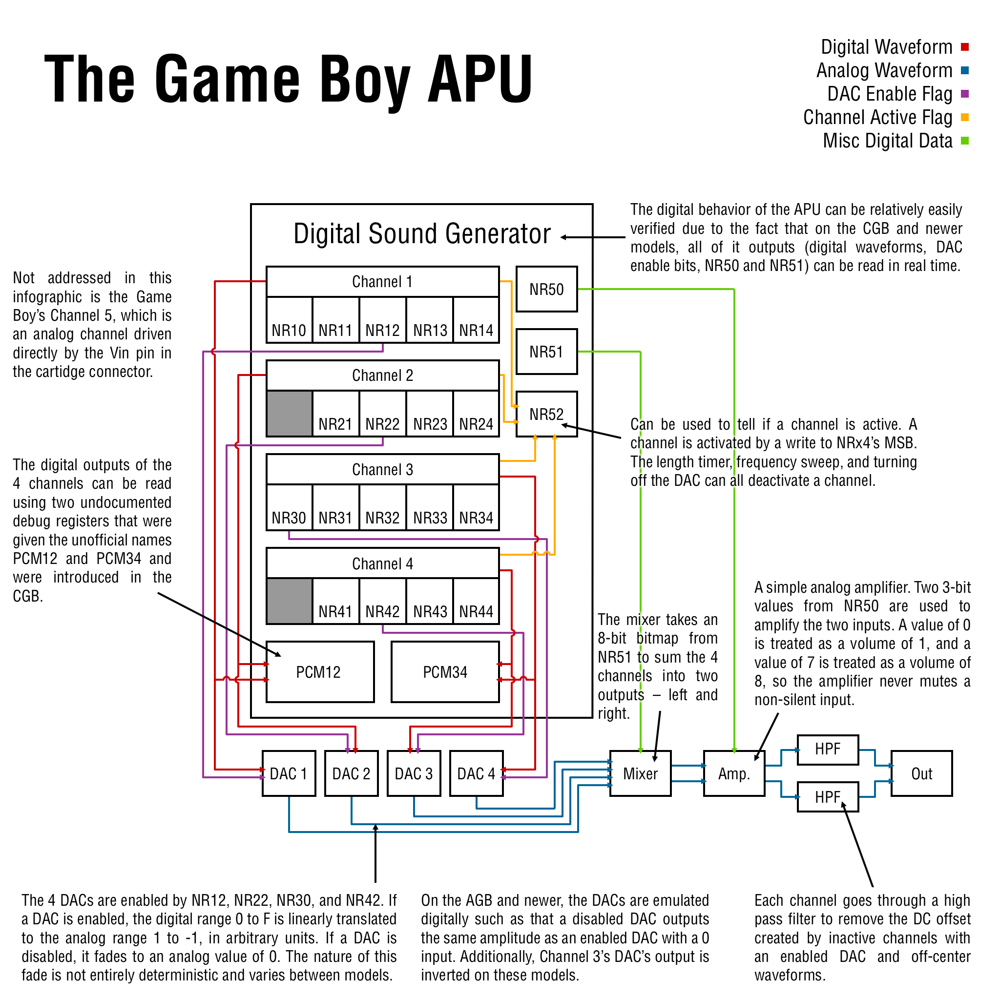

# サウンド

ゲームボーイの出力端子SO1とSO2には2つのサウンドチャンネルが接続されています。

また、カートリッジに接続された入力端子Vinがあります。これを両方の出力端子のどちらかに振り分けることができるようになっています。

ゲームボーイでは、以下の4つの方法で音を出すことができるようになっています。

- スイープ機能とエンベロープ機能を備えた矩形波チャネル (CH1)
- エンベロープ機能を備えた矩形波チャネル (CH2)
- 波形メモリをそなえたウェーブチャネル (CH3)
- エンベロープ機能を備えたノイズチャネル (CH4)

この4つの音を独立してコントロールし、それぞれの出力端子で別々にミックスすることができます。

サウンドのIOレジスタは、音を出している間は常に書き込みをすることができます。

SGBでは周波数が2.4%高くなります。

```
用語解説:
  スイープ(sweep): 一定の速度で周波数を変化させる事
  エンベロープ(envelope): 音が発音されてから聞こえなくなるまでの音量の時間的変化
  デューティ比(duty): 周期的な現象において、特定期間のうち現象が継続される期間の割合のこと
  サンプリング: 音のA/D変換
  サンプルレート: 1秒間にサンプリングを行う回数。高ければ高いほど音質がいい
  リサンプリング: あるサンプルレートのデジタル信号を別のサンプルレートの信号に変換する事
```

## 🟥 サウンドチャネル1 - CH1 - 矩形波チャネル(Tone & Sweep)

### FF10 - NR10 - CH1制御レジスタ(スイープ) (R/W)

> スイープ(sweep): 一定の速度で周波数を変化させる事

```
Bit 6-4 - スイープ時間(スイープの起こる間隔)
Bit 3   - スイープの増減
            0: + (周波数は大きくなる)
            1: - (周波数は小さくなる)
Bit 2-0 - スイープ時のシフト量 (n: 0-7)
```

スイープ時間(bit4-6):

値     | 内容
-------|-------------------------------
000    | スイープしない(周波数は変化しない)
001    | 7.8 ms  (1/128Hz)
010    | 15.6 ms (2/128Hz)
011    | 23.4 ms (3/128Hz)
100    | 31.3 ms (4/128Hz)
101    | 39.1 ms (5/128Hz)
110    | 46.9 ms (6/128Hz)
111    | 54.7 ms (7/128Hz)

各シフトによる周波数(NR13,NR14)の変化について、変化前の周波数を`X(t-1)`, 変化後の周波数を`X(t)`とすると`X(t)`は

```
X(t) = X(t-1) ± X(t-1)/2^n
```

と求められます。

### FF11 - NR11 - CH1制御レジスタ(音色・長さ) (R/W)

> デューティ比(duty): 周期的な現象において、特定期間のうち現象が継続される期間の割合のこと

```
Bit 7-6 - デューティ比 (R/W)
Bit 5-0 - サウンドの長さ (W) (t1: 0-63)
```

Bits 7-6 | デューティ比
---------|-------------
00       | 12.5% (`_-------_-------_-------`)
01       | 25%   (`__------__------__------`)
10       | 50%   (`____----____----____----`) (normal)
11       | 75%   (`______--______--______--`)

音声の長さは`(64-t1)*(1/256)`秒となります。そのため、t1(bit0-5)が小さいほど音声は長くなります。

音声の長さの値は、NR14のbit6がセットされている場合にのみ使用されます。

### FF12 - NR12 - CH1制御レジスタ(音量) (R/W)

> エンベロープ(envelope): 音が発音されてから聞こえなくなるまでの音量の時間的変化

```
 Bit 7-4 - エンベロープ初期音量 (0-0Fh) (0=音無し)
 Bit 3   - 音量変更方向 (0=小さくなっていく, 1=大きくなっていく)
 Bit 2-0 - エンベロープ速度 (n: 0-7)
            - 値が小さいほど変化が速くなる
            - 0だと変化なし
```

音量の変化(エンベロープ)のインターバルは `n*(1/64)`秒 です。そのため、n(bit0-2)が小さいほど音量の変化は早くなります。

### FF13 - NR13 - CH1制御レジスタ(周波数下位) (W)

FF14と合わせて11bitで周波数を指定します。FF13ではbit0-7が入っています。

### FF14 - NR14 - CH1制御レジスタ(周波数上位) (R/W)

```
Bit 7   - Initial (1=Restart Sound)  (W)
Bit 6   - 長さカウンタ有効フラグ(1=有効) (R/W)
Bit 5-3 - 不使用
Bit 2-0 - 周波数(bit8-10) (W)
```

長さカウンタ有効フラグ(bit6)がセットされている場合、NR11の音声の長さが0になったとき音声が止まります。

bit7がセットされている場合は、NR11の音声の長さが0になった時に、音声がリスタートします。

周波数の値はNR13とNR14の11bitの値を`x`(0..2047)とすると`131072/(2048-x) Hz`になります。

## 🟦 サウンドチャネル2 - CH2 - 矩形波チャネル(Tone)

この音声チャネルは、スイープの制御レジスタ(CH1ではNR10)がないことを除けば、CH1と同じように動作します。そのため書いてある内容もCH1とほとんど同じです。

### FF16 - NR21 - CH2制御レジスタ(音色・長さ) (R/W)

> デューティ比(duty): 周期的な現象において、特定期間のうち現象が継続される期間の割合のこと

```
Bit 7-6 - デューティ比 (R/W)
Bit 5-0 - サウンドの長さ (W) (t1: 0-63)
```

Bits 7-6 | デューティ比
---------|-------------
00       | 12.5% (`_-------_-------_-------`)
01       | 25%   (`__------__------__------`)
10       | 50%   (`____----____----____----`) (normal)
11       | 75%   (`______--______--______--`)

音声の長さは`(64-t1)*(1/256)`秒となります。そのため、t1(bit0-5)が小さいほど音声は長くなります。

音声の長さの値は、NR24のbit6がセットされている場合にのみ使用されます。

### FF17 - NR22 - CH2制御レジスタ(音量) (R/W)

> エンベロープ(envelope): 音が発音されてから聞こえなくなるまでの音量の時間的変化

```
 Bit 7-4 - エンベロープ初期音量 (0-0Fh) (0=音無し)
 Bit 3   - 音量変更方向 (0=小さくなっていく, 1=大きくなっていく)
 Bit 2-0 - エンベロープ速度 (n: 0-7)
            - 値が小さいほど変化が速くなる
            - 0だと変化なし
```

音量の変化(エンベロープ)のインターバルは `n*(1/64)`秒 です。そのため、n(bit0-2)が小さいほど音量の変化は早くなります。

### FF18 - NR23 - CH2制御レジスタ(周波数下位) (R/W)

FF24と合わせて11bitで周波数を指定します。FF23ではbit0-7が入っています。

### FF19 - NR24 - CH2制御レジスタ(周波数上位) (R/W)

```
Bit 7   - Initial (1=Restart Sound)  (W)
Bit 6   - 長さカウンタ有効フラグ(1=有効) (R/W)
Bit 5-3 - 不使用
Bit 2-0 - 周波数(bit8-10) (W)
```

長さカウンタ有効フラグ(bit6)がセットされている場合、NR21の音声の長さが0になったとき音声が止まります。

bit7がセットされている場合は、NR21の音声の長さが0になった時に、音声がリスタートします。

周波数の値はNR23とNR24の11bitの値を`x`(0..2047)とすると`131072/(2048-x) Hz`になります。

## 🌊 サウンドチャネル3 - CH3 - 波形メモリチャネル

このチャンネルは、デジタルサウンドを出力することができ、サンプルバッファ（Wave RAM）の長さは32桁に制限されています。

このサウンドチャンネルは、Wave RAMを矩形波で初期化すると、通常の音を出力することもできます。

このチャンネルには、エンベロープレジスタはなく、音量はNR32で設定します。

### FF1A - NR30 - CH3制御レジスタ(マスター) (R/W)

```
Bit 7 - 波形メモリチャネル有効フラグ (0=無効, 1=有効)  (R/W)
        - 0だと音が鳴らない
```

### FF1B - NR31 - CH3制御レジスタ(長さ) (W)

```
Bit 7-0 - 長さカウント値 (W) (t1: 0-255)
```

音声の長さは`(256-t1)*(1/256)`秒となります。

そのため、t1(bit0-7)が小さいほど音声は長くなります。音声の長さの値は、NR34のbit6がセットされている場合にのみ使用されます。

### FF1C - NR32 - CH3制御レジスタ(音量) (R/W)

```
Bits 6-5 - 音量 (R/W)
            - 00: 0%(ミュート)
            - 01: 100%
            - 10: 50% (つまり、1だけ右シフト)
            - 11: 25% (つまり、2だけ右シフト)
```

### FF1D - NR33 - CH3制御レジスタ(周波数下位) (R/W)

FF34と合わせて11bitで周波数を指定します。FF33ではbit0-7が入っています。

### FF1E - NR34 - CH3制御レジスタ(周波数上位) (R/W)

```
Bit 7   - Initial (1=サウンドをリスタート)  (W)
Bit 6   - 長さカウンタ有効フラグ(1=有効) (R/W)
Bit 5-3 - 不使用
Bit 2-0 - 周波数(bit8-10) (W)
```

長さカウンタ有効フラグ(bit6)がセットされている場合、NR31の音声の長さが0になったとき音声が止まります。

bit7がセットされている場合は、NR31の音声の長さが0になった時に、サウンドがリスタートします。

周波数の値は**CH1,CH2とは計算式が異なり**、NR33とNR34の11bitの値を`x`(0..2047)とすると`4194304/(64*(2048-x)) Hz`、つまり`65536/(2048-x) Hz`になります。

### FF30-FF3F - CH3波形メモリデータ (R/W)

この16バイトのメモリ領域には、32個の4bitのサンプルが格納され、上位4bitから順に再生されます。

波形メモリデータへのアクセスは、CH3が無効（NR30のbit7が0）の時のみ行うようにしてください。

そうしないと、アクセスしたときの挙動がおかしくなります。(ほとんどの機種では、CH3が現在読み込んでいるオフセットにバイトが書き込まれます。GBAでは、この書き込みは単に無視されます。)

## 🎺 サウンドチャネル4 - CH4 - ノイズチャネル

ホワイトノイズを出力するためのためのチャネルです。ホワイトノイズは、一定の周波数において、振幅を高低の間でランダムに切り替えることで行われます。

周波数に応じて、ホワイトノイズは硬くなったり柔らかくなったりします。

また、ランダムジェネレーターの機能に影響を与えて、出力がより規則的になるようにすることも可能で、その結果、ノイズの代わりにトーンを出力することが制限されます。

### FF20 - NR41 - CH4制御レジスタ(長さ) (W)

```
Bit 5-0 - 長さカウント値 (W) (t1: 0-63)
```

音声の長さは`(64-t1)*(1/256)`秒となります。そのため、t1(bit0-5)が小さいほど音声は長くなります。

音声の長さの値は、NR44のbit6がセットされている場合にのみ使用されます。

### FF21 - NR42 - CH4制御レジスタ(音量) (R/W)

> エンベロープ(envelope): 音が発音されてから聞こえなくなるまでの音量の時間的変化

```
 Bit 7-4 - エンベロープ初期音量 (0-0Fh) (0=音無し)
 Bit 3   - 音量変更方向 (0=小さくなっていく, 1=大きくなっていく)
 Bit 2-0 - エンベロープ速度 (n: 0-7)
            - 値が小さいほど変化が速くなる
            - 0だと変化なし
```

音量の変化(エンベロープ)のインターバルは `n*(1/64)`秒 です。そのため、n(bit0-2)が小さいほど音量の変化は早くなります。

### FF22 - NR43 - CH4制御レジスタ(周波数) (R/W)

振幅は与えられた周波数で高低をランダムに切り替えることで発生させます。

周波数が高くなると、ノイズはよりやわらかくなります。bit3をセットすると、出力がより規則的になり、一部の周波数はノイズよりもトーンに近い音になります。

```
Bit 7-4 - ノイズ周波数2(オクターブ指定) (s)
            - 値が小さいほど周波数が高くなる
            - 値が1増えるごとに、周波数は1/2,1/4,1/8…していく
Bit 3   - 長周期/短周期 (0=15bits(長周期), 1=7bits(短周期))
Bit 2-0 - ノイズ周波数1(カウント指定) (r)
            - 値が小さいほど周波数が高くなる
            - 周波数は1/nされる。nに入る値は、周波数テーブルから引き出される。(値0から順に、1,2,4,6,8,10,12,14)
```

周波数fは次の式で表されます。(`r=0`のときは`r=0.5`とします)

```
f = 524288 / r / 2^(s+1) Hz
```

### FF22 - NR44 - CH4制御レジスタ(リスタート) (R/W)

```
Bit 7   - Initial (1=サウンドをリスタート)  (W)
Bit 6   - 長さカウンタ有効フラグ(1=有効) (R/W)
Bit 5-0 - 不使用
```

長さカウンタ有効フラグ(bit6)がセットされている場合、NR41の音声の長さが0になったとき音声が止まります。

bit7がセットされている場合は、NR41の音声の長さが0になった時に、サウンドがリスタートします。

## 🔊 サウンド制御レジスタ

### FF24 - NR50 - 全体音量制御レジスタ (R/W)

ボリュームビットは、左右のサウンド出力のマスターボリュームを指定します。

SO2は左のヘッドフォンに、SO1は右のヘッドフォンに出力されます。

```
Bit 7   - 左出力有効フラグ (1=有効)
Bit 6-4 - 左音量  (0-7, 値が大きいほど音量が大きい)
Bit 3   - 右出力有効フラグ (1=有効)
Bit 2-0 - 右音量  (0-7, 値が大きいほど音量が大きい)
```

余談ですが、ゲームボーイに内蔵されている4つのサウンドチャネルに加えて、5つ目のサウンドチャネルをカートリッジ内の外部ハードウェアから供給することができます。この機能を使用した商用ゲームはなく、ゲームボーイアドバンスではこの機能は廃止されました。

### FF25 - NR51 - 各チャネル出力制御レジスタ (R/W)

```
Bit 7 - CH4左出力有効フラグ (1=有効)
Bit 6 - CH3左出力有効フラグ (1=有効)
Bit 5 - CH2左出力有効フラグ (1=有効)
Bit 4 - CH1左出力有効フラグ (1=有効)
Bit 3 - CH4右出力有効フラグ (1=有効)
Bit 2 - CH3右出力有効フラグ (1=有効)
Bit 1 - CH2右出力有効フラグ (1=有効)
Bit 0 - CH1右出力有効フラグ (1=有効)
```

### FF26 - NR52 - サウンドON/OFFレジスタ (R/W)

GBのプログラムでサウンドを使用しない場合は、このレジスタに\$00を書き込むことで、GBの消費電力を16%以上削減することができます。

bit7をクリアしてサウンドコントローラを無効にすると、すべてのサウンドレジスタの内容が破壊されます。

また、サウンドコントローラが無効にされている間は、（`0xFF26`を除いて）どのサウンドレジスタにもアクセスできません。

```
 Bit 7 - 全サウンド ON/OFF  (0: 全サウンド回路をOFF) (R/W)
 Bit 3 - サウンド4 ON/OFF (R)
 Bit 2 - サウンド3 ON/OFF (R)
 Bit 1 - サウンド2 ON/OFF (R)
 Bit 0 - サウンド1 ON/OFF (R)
```

このレジスタのbit0-3は、**読み取り専用**のステータスビットで、これらのビットに書き込んでも、**サウンドの有効化/無効化は行われません**。

このフラグは、初期フラグ（NR14,NR24,NR34,NR44のbit7）をセットしてサウンド出力が再開されたときにセットされ、フラグはサウンドの長さが終了するまで（有効な場合）セットされたままになります。

ボリュームエンベロープの音量がゼロになっても、サウンドフラグはオフになりません。

## 🧨 Pitfalls

TODO

## ⚙️ APU technical explanation



### Game Boy, Game Boy Color

TODO

### Game Boy Advance

TODO

## 📜 参考記事

- [GB音源 - ニコニコ大百科(仮)](https://dic.nicovideo.jp/a/gb%E9%9F%B3%E6%BA%90)

