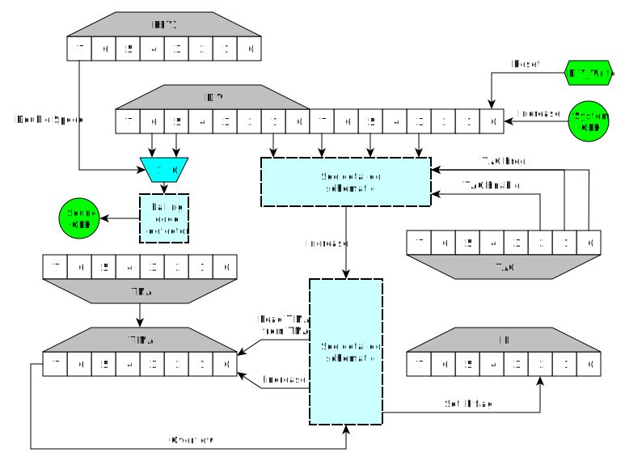
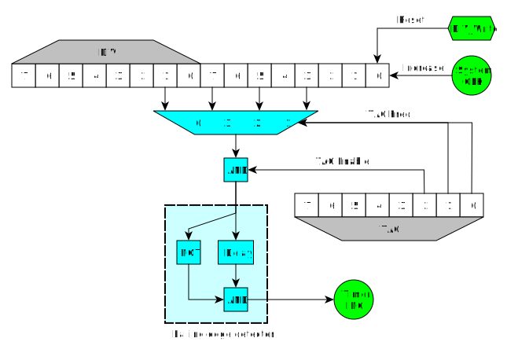
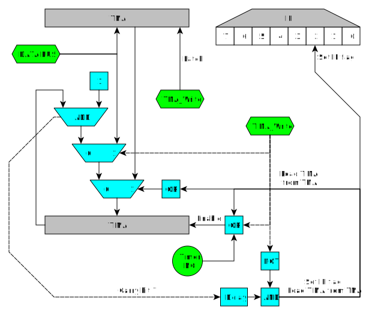

# タイマー

>**Note**  
> ここでのタイマーはMBC3のRTCとは別物であることに注意してください。

## 👾 レジスタ

### FF04 - DIV - Dividerレジスタ (R/W)

このレジスタは、16384Hz（SGBでは16779Hz）でインクリメントされます。つまり`1/16384`秒ごとにインクリメントされるということです。

ゲームボーイでは1クロックサイクルが`1/4194304`秒なので`1/16384`秒は`4194304/16384`で256、つまりDIVレジスタは256クロックサイクル(64マシンサイクル)ごとにインクリメントされます。

このレジスタに何らかの値を書き込むと、値を書き込む代わりに`$00`にリセットされます。

また、このレジスタは、stop命令を実行するとリセットされ、stopモードが終了すると再びカウントを始めます。

これは、CPUの速度切り替え時にも発生します。

DIVはCGBの倍速モードでは32768Hzでインクリメントされるようになります。これは`(4194304*2)/(16384*2)`で通常モードと変わらず256クロックサイクルです。

### FF05 - TIMA - Timerカウンタレジスタ (R/W)

このタイマーは、TACレジスタ(`$FF07`)で指定されたクロック周波数でインクリメントされます。

値がオーバーフローする（`$FF`を超える）と、TMA（`$FF06`）の値にリセットされ、後述のように割り込みが要求されます。

### FF06 - TMA - Timerモジュロレジスタ (R/W)

TIMAがオーバーフローすると、このレジスタの値にリセットされ、割り込みが要求されます。

たとえば、TMAを`$FF`に設定すれば、インクリメントごとにTIMAがオーバーフローするため、TACで選択されたクロック周波数で割り込みを要求できます。

また、TMAを`$FE`に設定すると、割り込みは2インクリメントごとにしか要求されず、事実上、選択されたクロックを2で割ることになります。TMAを`$FD`に設定すると、クロックを3で割ることになり、以下同様です。

### FF07 - TAC - Timer制御レジスタ (R/W)

```
Bit 0-1 TIMAのクロック
          00: CPUクロック / 1024 (DMG, SGB2, CGB:   4096 Hz, SGB1:   ~4194 Hz, CGB倍速:   8192 Hz)
          01: CPUクロック / 16   (DMG, SGB2, CGB: 262144 Hz, SGB1: ~268400 Hz, CGB倍速: 524288 Hz)
          10: CPUクロック / 64   (DMG, SGB2, CGB:  65536 Hz, SGB1:  ~67110 Hz, CGB倍速: 131072 Hz)
          11: CPUクロック / 256  (DMG, SGB2, CGB:  16384 Hz, SGB1:  ~16780 Hz, CGB倍速:  32768 Hz)
Bit 2   タイマー有効フラグ
```

CPUクロックは例えばゲームボーイの場合、4194304Hzになります。

タイマー有効フラグ(bit2)はTIMAのみに影響し、DIVのカウントは常に行われます。

## 🔋 回路図



## タイマーとDIVレジスタの関係

TACとDIVを含む回路の概略図です。



マルチプレクサの入力に接続されている値は、それらのビットの値であり、それらのビットのキャリーではないことに注目してください。これにはいくつかの理由があります。

- DIVに書き込むとカウンター全体がリセットされるので、タイマーにも影響があります。
- DIVに書き込む際、現在の出力が1でタイマーが有効の場合、DIVをリセットした後の新しい値は0となるため、立下りエッジ検出器が立下りエッジを検出してTIMAが増加します。
- TACに書き込むとき、以前に選択されたマルチプレクサの入力が1で、新しい入力が0の場合、TIMAも増加します。これは、タイマー無効時には起こりませんが、タイマーを無効する際には起こります（DIVへの書き込みと同じ効果です）。次のコードは、DMGとMGBでの動作を説明しています。

```
    clocks_array[4] = {1024, 16, 64, 256}

    old_clocks = clocks_array[old_TAC&3]
    new_clocks = clocks_array[new_TAC&3]

    old_enable = old_TAC & BIT(2)
    new_enable = new_TAC & BIT(2)

    sys_clocks = 16 bit system counter

    IF old_enable == 0 THEN
        glitch = 0 (*)
    ELSE
        IF new_enable == 0 THEN
            glitch = (sys_clocks & (old_clocks/2)) != 0
        ELSE
            glitch = ((sys_clocks & (old_clocks/2)) != 0) && ((sys_clocks & (new_clocks/2)) == 0)
        END IF
    END IF
```

The sentence marked with a (*) has a different behaviour in GBC (AGB and AGS seem to have strange behaviour even in the other statements). When enabling the timer and maintaining the same frequency it doesnt glitch. When disabling the timer it doesnt glitch either. When another change of value happens (so timer is enabled after the write), the behaviour depends on a race condition, so it cannot be predicted for every device.

## TIMAオーバーフロー時の挙動

TIMAがオーバーフローすると、TMAからの値がロードされIFのタイマーフラグが1に設定されますが、この現象はTIMAがオーバーフローしてすぐには起こりません。

タイマー割り込みは、TIMAのオーバーフローから1マシンサイクル（4クロックサイクル）遅れます。TMAのTIMAへのリロードも遅れます。

TIMAがオーバーフローした後の1マシンサイクルでは、TIMAの値がTMAからの値ではなく`00h`になります。これは、オーバーフローが発生したときにのみ起こり、上位ビットが1から0になったときには起こりません。

For example (SYS is the system internal counter divided by 4 for easier understanding, each increment of the graph is 1 cycle, not 1 clock):

```
Timer overflows:

              [A] [B]
SYS  FD FE FF |00| 01 02 03
TIMA FF FF FF |00| 23 23 23
TMA  23 23 23 |23| 23 23 23
IF   E0 E0 E0 |E0| E4 E4 E4

Timer doesn't overflow:

              [C]
SYS  FD FE FF 00 01 02 03
TIMA 45 45 45 46 46 46 46
TMA  23 23 23 23 23 23 23
IF   E0 E0 E0 E0 E0 E0 E0

```

- During the strange cycle \[A\] you can prevent the IF flag from being
set and prevent the TIMA from being reloaded from TMA by writing a value
to TIMA. That new value will be the one that stays in the TIMA register
after the instruction. Writing to DIV, TAC or other registers wont
prevent the IF flag from being set or TIMA from being reloaded.

- If you write to TIMA during the cycle that TMA is being loaded to it
\[B\], the write will be ignored and TMA value will be written to TIMA
instead.

- If TMA is written the same cycle it is loaded to TIMA \[B\], TIMA is
also loaded with that value.

- This is a guessed schematic to explain the priorities with registers
TIMA and TMA:



TMA is a latch. As soon as it is written, the output shows that value.
That explains that when TMA is written and TIMA is being incremented,
the value written to TMA is also written to TIMA. It doesnt affect the
IF flag, though.
