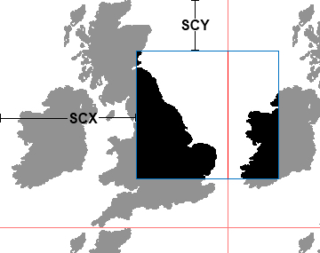
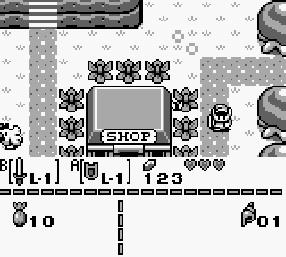

# 🗺 座標とスクロール

これらのレジスタは、モード3でもアクセス可能ですが、現在のスキャンラインが終了するまでは影響を及ぼしません。影響が現れるのは次のスキャンラインからです。

## FF42 - SCY - Yスクロール (R/W)

256x256ピクセルのBGマップの中で、160x144ピクセルの画面領域の左上のY座標を指定します。0〜255の範囲の値が使用できます。

## FF43 - SCX - Xスクロール (R/W)

256x256ピクセルのBGマップの中で、160x144ピクセルの画面領域の左上のX座標を指定します。0〜255の範囲の値が使用できます。

## FF44 - LY - Y座標レジスタ (R)

LYは、現在のスキャンラインを示し、0から153までの任意の値を持つことができます。

LYが144から153までの値に収まっているときは、VBlank期間であることを示しています。

## FF45 - LYC - LY比較レジスタ (R/W)

ゲームボーイは、LYCレジスタとLYレジスタの値を常に比較します。

両方の値が同じである場合、STATレジスタの`LYC=LY`フラグ(bit6)がセットされ、（有効な場合は）STAT割り込みがリクエストされます。

## FF4A - WY - ウィンドウY座標 (R/W)

ウィンドウの左上のY座標を指定します。

ウィンドウは、通常の背景より手間に表示されるもう一つの背景領域のようなものです。OBJ は通常の BG と同様にウィンドウの手前、または奥に表示されます。

例えば、下の画像では、メニュー画面(画面下部)にウィンドウを使っています。

XY座標の両方がそれぞれWX=0..166、WY=0..143の範囲にあるときに、ウィンドウが有効(LCDCのbit5)ならウィンドウが画面に表示されます。

WX=7、WY=0の場合、ウィンドウは画面の左上に配置され、背景を完全に覆います。

WXが0..6および166のときは、ハードウェアのバグにより挙動に信頼性がありません。WXを0に設定すると、SCXが変化したときにウィンドウが水平方向に乱れます。

`SCX%8`の値に応じて、動作が少し複雑になるので、自分で試してみてください。

## FF4B - WX - ウィンドウX座標+7 (R/W)

ウィンドウの左上のX座標を指定します。

詳細はWYのほうを見てください。

