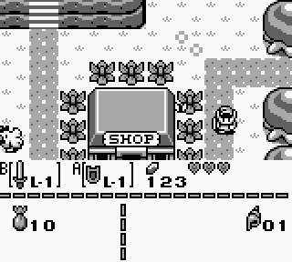

# ウィンドウ

## FF4A - WY - ウィンドウY座標 (R/W)

ウィンドウの左上のY座標を指定します。

ウィンドウは、通常の背景より手間に表示されるもう一つの背景領域のようなものです。OBJ は通常の BG と同様にウィンドウの手前、または奥に表示されます。

例えば、下の画像では、メニュー画面(画面下部)にウィンドウを使っています。



XY座標の両方がそれぞれWX=0..166、WY=0..143の範囲にあるときに、ウィンドウが有効(LCDCのbit5)ならウィンドウが画面に表示されます。

WX=7、WY=0の場合、ウィンドウは画面の左上に配置され、背景を完全に覆います。

## FF4B - WX - ウィンドウX座標+7 (R/W)

ウィンドウの左上のX座標を指定します。

```
  Bit
  0-7  ウィンドウX座標+7; ウィンドウは (WX-7, WY) から表示される
```

> [!WARNING]
> WX values 0 and 166 are unreliable due to hardware bugs.  
> If WX is set to 0, the window will “stutter” horizontally when SCX changes (depending on SCX % 8).  
> If WX is set to 166, the window will span the entirety of the following scanline.

## 描画中にレジスタを変更したときの挙動

While the Window should work as just mentioned, writing to WX, WY etc. mid-frame shows a more articulated behavior.

ウィンドウがスキャンライン上に表示されるためには、以下の条件を満たす必要があります。

- WY condition was triggered: i.e. at some point in this frame the value of WY was equal to LY (checked at the start of Mode 2 only)
- WX condition was triggered: i.e. the current X coordinate being rendered + 7 was equal to WX
- `LCDC.5`(ウインドウ有効フラグ) が 1

If the WY condition has already been triggered and at the start of a row the window enable bit was set, then resetting that bit before the WX condition gets triggered on that row yields a nice window glitch pixel where the window would have been activated.
