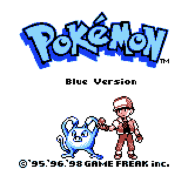
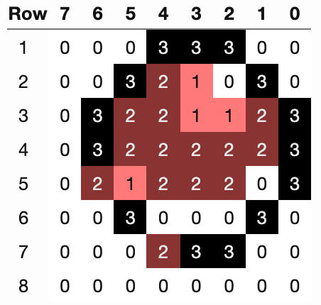
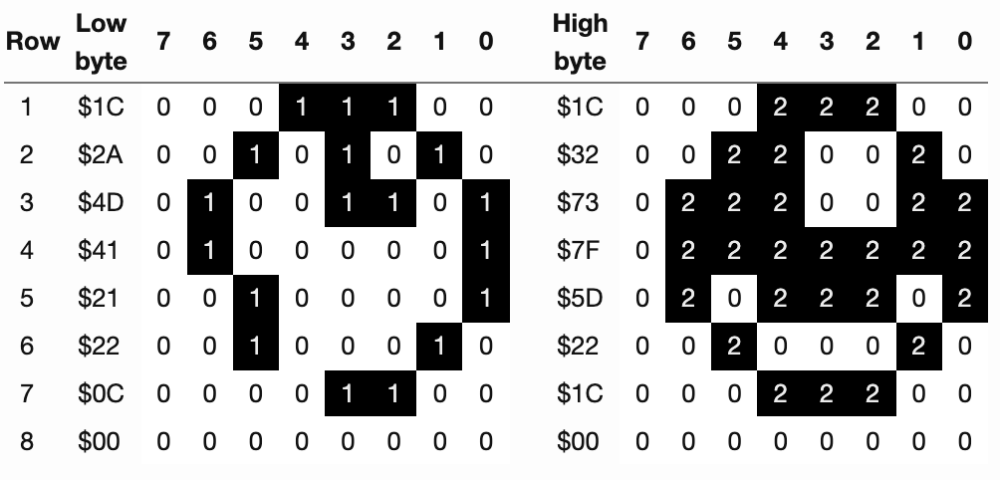

# タイルデータ

タイルデータは、VRAMの`0x8000..97FF`(6144バイト)のメモリ領域に格納されます。1枚のタイルが16バイトなので、この領域には384枚のタイルのデータが定義されています。CGBモードでは、2つのVRAMバンクがあるため、2倍の768タイルが格納できます。

各タイルは8x8ピクセルで、色深度は2bit(4色)です。

タイルは、背景/ウィンドウの一部として、またはスプライトとして表示することができます。なお、OBJでは色0は使われず、透明になっています。

タイルデータ領域は128枚のタイルを1つのブロックとして次のような構成になっています。

種類 | Block0(0x8000..87FF) | Block1(0x8800..8FFF)  | Block2(0x9000..97FF)
----|------|--------|-------------
  スプライト | 0..127  | 128..255 | -
  BG/Win(LCDC.4=1) | 0..127  | 128..255 | -
  BG/Win(LCDC.4=0) | -  | 128..255 | 0..127

タイルは常に8bitの整数でインデックスされますが、次のようにアドレッシング(インデックスからアドレスを算出する方法)が異なります。

0x8000アドレッシングでは、0x8000をベースポインタとし、符号なしのアドレッシング（タイル0..127がブロック0に、タイル128..255がブロック1に入る）を採用しています。

0x8800アドレッシングでは、0x9000をベースポインタとして使用し、符号付きアドレッシングを使用します。つまり、タイル0..127がブロック2に、タイル-128..-1がブロック1に入ります。(ブロック1は両方のアドレッシング方式で共有されています。)

スプライトは常に0x8000アドレッシングによってタイルデータを指定します。つまりスプライトが利用できるタイルデータはタイルデータ領域のうち`0x8000..8FFF`に限られます。

背景/ウィンドウは`LCDC.4`でアドレッシングを変更できます。bit4が0なら`0x8800..97FF`(0x8800アドレッシング)を、1なら`0x8000..8FFF`(0x8000アドレッシング)を使用します。

## 2bppフォーマット

各タイルは16バイトで構成され、タイルの各行は2バイトで表現されます。

各行では、1バイト目で各ピクセルの色番号(色ID, カラーIDとも)の最下位ビットを、2バイト目で最上位ビットを指定しています。両バイトとも、ビット7が左端の画素、ビット0が右端の画素を表します。

```
https://wiki.superfamicom.org/learning-the-gfx-format-2bpp-gameboy-and-snes より引用

Tile:                                     Image:

  .33333..                     .33333.. -> 01111100 -> $7C
  22...22.                                 01111100 -> $7C
  11...11.                     22...22. -> 00000000 -> $00
  2222222. <-- digits                      11000110 -> $C6
  33...33.     represent       11...11. -> 11000110 -> $C6
  22...22.     color                       00000000 -> $00
  11...11.     numbers         2222222. -> 00000000 -> $00
  ........                                 11111110 -> $FE
                               33...33. -> 11000110 -> $C6
  [. = color 0]                            11000110 -> $C6
                               22...22. -> 00000000 -> $00
                                           11000110 -> $C6
                               11...11. -> 11000110 -> $C6
                                           00000000 -> $00
                               ........ -> 00000000 -> $00
                                           00000000 -> $00
```

色番号は、現在のパレットに応じて、実際の色に変換されます。

ただし、タイルがOBJで使用される場合、色番号の0は透明を意味します。

パレットは、IOレジスタ`BGP, OBP0, OBP1`(モノクロ)、`BCPS/BGPI, BCPD/BGPD, OCPS/OBPI, OCPD/OBPD`（カラー）を通じて定義されます。

### 例

例えば、ポケモン赤のタイトル画面で主人公が手に持っているモンスターボールを描きたいとします。

&nbsp;&nbsp;

そして、タイルを2つの[ビットプレーン](https://ja.wikipedia.org/wiki/%E3%83%93%E3%83%83%E3%83%88%E3%83%97%E3%83%AC%E3%83%BC%E3%83%B3)に分け、下位ビットプレーンには0か1の値のみ、上位ビットプレーンには0か2の値のみを持たせます。各ピクセルごとにそれらを足し合わせると、上のようなイメージになります。



そして、2つのビットプレーンを上図のようにインターリーブして、このモンスターボールのタイルを表す16バイトを得ます。

```
  $1C $1C $2A $32 $4D $73 $41 $7F $21 $5D $22 $22 $0C $1C $00 $00
```

